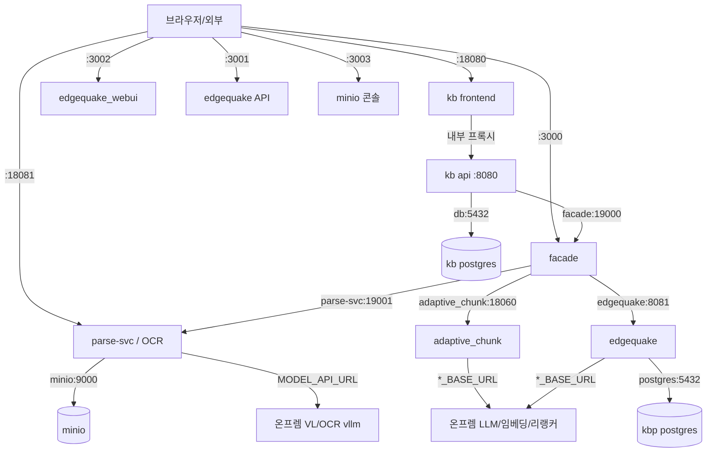

# 폐쇄망 배포 아키텍처 & 포트 맵 (kbp 엔진 + kb 웹앱)

> 신한자산신탁 지식베이스 폐쇄망(air-gap, RHEL + Podman rootful) 배포의 구성·네트워크·
> 포트·데이터흐름 참조 문서. 나중에 포트/구조가 헷갈릴 때 이 문서를 본다.
> 최종 갱신: 2026-08-03.

---

## 1. 큰 그림

같은 RHEL 호스트에 **두 개의 podman-compose 스택**이 뜬다.

| 스택 | 프로젝트명 | 역할 | compose |
|------|-----------|------|---------|
| **kbp** | `kbp` | 파이프라인 엔진(파싱·청킹·그래프·검색) | `8.kb-pipeline/docker-compose.airgap.yml` |
| **kb** | `kb` | 웹앱(로그인·업로드·챗 UI + 백엔드) | `knowledge_base/docker-compose.airgap.yml` |

- **kbp 를 먼저 기동**해야 한다 → 공유 네트워크 `kbp_kbp` 가 생성됨.
- **kb 는 그 공유 네트워크(`kbp_kbp`)에 붙어** facade 에 컨테이너 DNS 로 직결한다.
  doc_guard·MinIO 는 **facade 가 은닉**한다(`/gate/*`, `/objects/*`) — kb 는 두 주소를 모른다.
  예외는 브라우저의 이미지 읽기다: kb 프론트의 `/obj/*` 프록시가 minio 를 직접 본다(데이터평면).
- 모델(LLM·임베딩·리랭커·VL-OCR)은 **온프렘 vllm 컨테이너**(compose 밖, 예: `paddleocr-vl`,
  `dotsmocr-vllm`)가 별도로 서빙하고, `.env` 의 `MODEL_API_URL`·`*_BASE_URL` 로 가리킨다.

```
                              [ 사용자 브라우저 / 외부 클라이언트 ]
                                          │
        ┌──────────────┬───────────────┬──┴────────────┬──────────────┐
      :18080          :3000          :3002/:3001       :3003        :18081
     kb front        facade         webui/eq-API      minio 콘솔   parse-svc(OCR)
        │              │
        │(내부프록시)   │
        ▼              ▼
   kb api(8080) ──► facade(19000) ──► parse-svc(19001) / adaptive_chunk(18060) / edgequake(8081)
        │                    │                                         │
        │                    └──► doc_guard(8000) [/gate/*]            │
        │                    └──► minio(9000)     [/objects/*]         ▼
        ▼                                                  kbp postgres(5432) + minio(9000)
   kb db(5432)                                             [그래프/벡터]   [페이지이미지]
   [별도 앱DB]

   ── 공유 네트워크: kbp_kbp (컨테이너 DNS: facade, minio, doc_guard, edgequake, ...) ──
   ── 온프렘 모델(vllm, compose 밖): MODEL_API_URL → paddleocr-vl:8104 / dotsmocr:8102 ──
```



---

## 2. 포트 맵 (호스트 → 컨테이너)

**규칙:** 컨테이너 **내부 포트는 절대 안 바뀐다**(내부 DNS 통신은 항상 내부 포트 사용).
바뀌는 건 **호스트 publish 포트(외부 접속용)**뿐이다.

### kbp 스택
| 호스트 | →컨테이너 | 서비스 | 용도 | 외부노출 | 방화벽 |
|:------:|:--------:|--------|------|:-------:|:-----:|
| **3000** | 19000 | facade | `/parse` `/chunk` `/search` `/insert` … 파이프라인 관문 | ✅ | 열기 |
| **3001** | 8081 | edgequake API | 그래프/벡터 엔진 REST (webui 가 브라우저에서 호출) | ✅ | 열기 |
| **3002** | 3000 | edgequake_webui | 그래프 확인 UI | ✅ | 열기 |
| **3003** | 9001 | minio 콘솔 | 버킷관리 웹 UI | ✅ | 열기 |
| ~~3004~~ | 8000 | doc_guard | **외부노출 없음** — facade `/gate/*` 가 은닉한다 | ❌ | 닫기 |
| **18081** | 19001 | parse-svc | OCR/파싱 엔진 (pdf·xlsx·docx·이미지 VL) | ✅ | 열기 |
| 18060 | 18060 | adaptive_chunk | 청킹 허브 | 내부 | 닫기 |
| 5433 | 5432 | postgres | edgequake 그래프 DB(pgvector+AGE) | 디버그 | **닫기** |
| — | 9000 | minio S3 API | 객체 저장(내부 DNS `minio:9000`) | 내부 | 닫기 |

### kb 스택
| 호스트 | →컨테이너 | 서비스 | 용도 | 외부노출 | 방화벽 |
|:------:|:--------:|--------|------|:-------:|:-----:|
| **18080** | 3000 | frontend | 웹앱(브라우저 접속) | ✅ | 열기 |
| 8080 | 8080 | api | 백엔드 REST(프론트가 내부 프록시) | publish O, 외부 선택 | 닫기 |
| — | — | worker | 다건 업로드 워커(publish 없음) | 내부 | — |
| 5434 | 5432 | db | 웹앱 DB(사용자·KB·chunks_meta) | 디버그 | **닫기** |

### 온프렘 모델 (compose 밖, vllm-portable — 참고)
| 호스트 | 서비스 | 용도 |
|:------:|--------|------|
| 8104 | paddleocr-vl | VL OCR 모델 |
| 8102 | dotsmocr-vllm | VL OCR 모델 |

> `MODEL_API_URL`(parse-svc) / `*_BASE_URL`(edgequake·adaptive) 가 이 온프렘 엔드포인트를 가리킨다.

### 방화벽 요약
```bash
# 열 포트: kbp(3000 3001 3002 3003 18081) + kb(18080)
for p in 3000 3001 3002 3003 18081 18080; do firewall-cmd --permanent --add-port=$p/tcp; done
firewall-cmd --reload
```
**DB(5433·5434)·adaptive(18060)·api(8080)·minio S3(9000) 는 열지 않는다**(내부/디버그 전용).

---

## 3. 네트워크 모델

- **kbp 스택**: 단일 네트워크 `kbp`(= 실제명 `kbp_kbp`). 모든 kbp 서비스가 여기에.
- **kb 스택**: **단일 네트워크 전략** — db·api·worker·frontend 전부 `kbp_shared`(external: `kbp_kbp`)
  **하나에만** 붙는다. (`kb_net` 폐지)

### ⚠️ 왜 kb 를 단일 네트워크로 두나 (중요 교훈)
컨테이너가 **네트워크 2개에 물리면** podman/netavark 의 publish 가 **비대칭 라우팅**으로 깨져,
**`127.0.0.1` 로는 붙는데 서버 IP(외부)로는 안 붙는다.** 그래서 publish 하는 kb 서비스는
반드시 **single-homed**(네트워크 1개)로 둔다. 내부 통신(api→db, frontend→api, api→facade,
frontend→minio)은
모두 이 공유망 DNS 로 이뤄지므로 기능 손실 없음.

### 컨테이너 DNS (내부 통신 — 포트 리맵과 무관, 항상 내부 포트)
| 부르는 쪽 | 대상 DNS | 용도 |
|-----------|----------|------|
| kb api / worker | `facade:19000` | 적재/검색 |
| kb api / worker | `facade:19000/objects/*` | 원본·페이지이미지 쓰기 / staging (facade 가 MinIO 은닉) |
| kb api / worker | `facade:19000/gate/*` | xlsx 게이트(facade 가 doc_guard 은닉) |
| facade / facade-worker | `doc_guard:8000` | 게이트 판정 |
| facade / facade-worker | `minio:9000` | 객체 I/O + 잡 staging |
| kb **frontend** | `minio:9000` | `/obj/*` 프록시 — 브라우저 이미지 읽기(데이터평면, 은닉 대상 아님) |
| kb api / worker | `db:5432` | 앱 DB |
| facade | `parse-svc:19001` `adaptive_chunk:18060` `edgequake:8081` | 파이프라인 |
| edgequake | `postgres:5432` | 그래프 DB |

---

## 4. 데이터 흐름

### (a) 웹앱 경유 적재/검색
```
브라우저 → kb frontend(:18080) → (내부프록시) kb api(:8080)
  → facade(:19000) → parse-svc / adaptive_chunk / edgequake → kbp postgres·minio
```

### (b) facade 직접 호출 (웹앱 없이 파이프라인만)
```
외부 클라이언트 → facade(:3000)
  POST /parse  (multipart file)      → {enriched_content, ...}   ← 키 불필요
  POST /chunk  (json enriched_content)→ {chunks, method_selected} ← 키 불필요
  POST /search /insert /doc ...        → X-Facade-Key 필요(KBP_FACADE_KEY)
```

### (c) 그래프 확인 UI
```
브라우저 → webui(:3002)  (페이지 로드)
브라우저 → edgequake API(:3001)  (그래프 데이터 — 브라우저가 직접 호출)
  ⚠️ 그래서 3002·3001 둘 다 열어야 하고, EDGEQUAKE_WEBUI_API_URL=http://<서버IP>:3001 필수
```

---

## 5. 런타임 주의점 (폐쇄망 특화 — 과거 이슈 정리)

| 항목 | 내용 |
|------|------|
| **tiktoken** | adaptive_chunk 가 최초 청킹 시 `cl100k_base` BPE 를 인터넷에서 받으려다 실패했음. → 이미지 빌드 때 `TIKTOKEN_CACHE_DIR=/opt/tiktoken_cache` 에 프리페치해 해결(adaptive_chunk/Dockerfile). |
| **webui pnpm** | `pnpm start` 가 `packageManager` 핀 버전을 registry 에서 자기설치하려다 실패. → CMD 를 `node_modules/.bin/next start` 로 변경(edgequake_webui/Dockerfile). |
| **EDGEQUAKE_WEBUI_API_URL** | 브라우저가 edgequake API 에 닿는 URL. API 호스트포트(=3001)와 일치해야 함. 원격은 `http://<서버IP>:3001`. 안 맞으면 그래프 빈 화면. |
| **KBP_FACADE_KEY** | facade 를 외부(:3000) 노출하므로 반드시 설정. 없으면 insert/삭제 API 까지 무인증 노출. `/parse`·`/chunk` 는 설계상 무키. |
| **healthz** | kb api 헬스경로는 `/healthz`(‘/health’ 아님). compose healthcheck 가 틀리면 api 가 영원히 unhealthy → frontend 안 뜸. |
| **다중 네트워크 publish** | §3 참조 — publish 서비스는 single-homed 필수. |
| **eq_eq_default_graph 에러 로그** | edgequake pg_ping 이 적재 전 그래프를 프로브해서 나는 **양성 노이즈**. 첫 적재 후 사라짐. 무시. |
| **DB 포트** | 5433/5434 외부노출 금지(무인증 노출). 필요 시 SSH 터널. |

---

## 6. 설정 출처

- 엔드포인트/시크릿/모델명/포트: 전부 각 스택의 **`.env`** (템플릿 `.env.airgap.example`).
- 앱 소스에 하드코딩된 값 없음(전부 env-driven). 포트 변경도 compose(호스트 매핑)만 → **이미지 재빌드 불필요**.
- 배포 절차: `docs/airgap-deploy.md`(kbp), `knowledge_base/docs/airgap-deploy.md`(kb).
