# EXP-C1 run-01 — original / GW / VL / metrics review

이 문서의 각 이미지는 두 엔진에 실제 전송된 JPEG와 동일하며 `features.tsv`의 SHA-256으로 검증된다.

> **2026-08-13 data correction:** 기존 `prior GW label`은 legacy label의 숫자 key를 현재
> sample 행 번호로 잘못 결합한 값이므로 모두 제외했다. 예를 들어 I19에 표시됐던
> `신탁계약→신학계악, 수익자→수락자`는 실제로 다른 문서(서울 종로구 p141)의 과거
> 300 DPI output에서 나온 문구다. 상세 근거와 영향 범위는
> [`LEGACY_LABEL_JOIN_CORRECTION.md`](LEGACY_LABEL_JOIN_CORRECTION.md)에 있다.

> **2026-08-12 현행화:** 최초 VL empty 5건(I14, I17, I18, I37, I46)을 저장된
> 동일 JPEG bytes로 한 번씩 재호출했다. 아래 5개 sample의 `VL parser output`에는 GW 출력과
> 바로 비교할 수 있도록 retry-01 전문을 배치했다. 최초 empty 사실은 각 sample의
> `chars: ... VL 0 · errors: ... VL empty` 실행 기록으로 보존한다.
> 상세 집계는 [`retries/vl-empty-retry-01/RESULT.md`](retries/vl-empty-retry-01/RESULT.md),
> 실행 조건과 입력 hash는 [`manifest.json`](retries/vl-empty-retry-01/manifest.json)에 있다.

## VL empty retry-01 요약

| ID | 최초 VL | Retry VL | 원본 대조 | GW 대비 | `VL_BENEFICIAL` |
|---|---:|---:|---|---|---:|
| I14 | empty | 1,395 chars | retrieval pass, no material error | VL | true |
| I17 | empty | 3,960 chars | retrieval pass, table-history flattening | VL | true |
| I18 | empty | 1,887 chars | retrieval pass, minor wording errors | GW | false |
| I37 | empty | 1,093 chars | truncated, retrieval fail | both fail | false |
| I46 | empty | 1,591 chars | retrieval pass, identity/amounts preserved | VL | true |

- empty 재발: 0/5
- retry retrieval pass: 4/5
- retry confirmed hallucination: 0/5
- 새 `VL_BENEFICIAL`: 3/5 (I14, I17, I46)
- 한 번의 empty retry를 적용한 전체 16쪽 관찰: `VL_BENEFICIAL` 3/16 → 6/16
- 해석: empty는 terminal failure로 단정할 수 없지만 I37처럼 non-empty truncation도 있으므로
  `non-empty = 성공`으로 판정하지 않는다.

## 현행 원본 대조 분석 — 16쪽 한눈에 보기

VL 최초 empty 5건은 retry-01 판정을 사용한다. 아래 값은 과거 label이 아니라 이 문서에
삽입된 원본 이미지와 현재 GW/VL 출력 전문을 직접 대조한 결과다.

| ID | GW | VL (retry 반영) | Winner | VL beneficial | 핵심 비교 근거 |
|---|---|---|---|---:|---|
| I03 | PASS / minor | PASS / minor | TIE | false | 날짜 보존; 양쪽 경미한 오류 |
| I10 | PASS / minor | PASS / critical / hallucination | GW | false | VL `③항→⑨항` |
| I14 | PASS / critical | PASS / clean | VL | true | GW `1,000,000→1,000.000` |
| I17 | BORDERLINE / critical | PASS / clean | VL | true | VL이 사업목적 용어·날짜 복구 |
| I18 | PASS / minor | PASS / minor | GW | false | VL wording error가 더 많음 |
| I19 | PASS / critical | PASS / clean | VL | true | VL이 `사채/부언/없애기/액면` 복구 |
| I20 | PASS / minor | PASS / minor / suspect | VL | false | VL `가처분이의→가치분이의` |
| I24 | FAIL / critical | FAIL / truncated | BOTH_FAIL | false | 중국어 표 / header 절단 |
| I26 | BORDERLINE / critical / partial | PASS / clean | VL | true | VL이 누락 당사자 복구 |
| I35 | BORDERLINE / critical / partial | PASS / clean | VL | true | VL이 사건번호·문맥 복구 |
| I37 | FAIL / critical | FAIL / truncated | BOTH_FAIL | false | GW 전면 훼손; VL ⑤항 중간 절단 |
| I41 | PASS / critical | PASS / critical | TIE | false | 양쪽 `테스타디앤씨→테스타디엔씨` |
| I42 | PASS / critical / partial | PASS / critical | VL | false | VL에도 `용죽1로→용죽로` 잔존 |
| I46 | BORDERLINE / critical | PASS / clean | VL | true | VL이 원고 `손세라` 복구 |
| I49 | PASS / minor | FAIL / truncated | GW | false | VL 첫 문장 절단 |
| I56 | BORDERLINE / critical | BORDERLINE / critical / hallucination | BOTH_FAIL | false | 양쪽 신원 훼손; VL 숫자 생성·혼합 |

## I03 · source index 3 · original p22

- current original-grounded analysis: **GW `RETRIEVAL_PASS / MINOR_ERROR` · VL `RETRIEVAL_PASS / MINOR_ERROR` · winner `TIE` · `VL_BENEFICIAL=false`**
- comparison evidence: 양쪽 모두 `2016.11.14/2016.11.16`을 보존. GW에는 barcode noise, VL은 `일반인으로서는`을 `일반인으로서도`로 변경.
- current v1: `accept_gw` — no hard-fail reason
- chars: GW 705 / VL 698 · errors: GW `-'` / VL `-'`
- exact input: [`page_images/I03_01_운정지역주택조합_대리사무_채권자대위권등_신창근외17_상대방_소장_pdf_p22.jpg`](page_images/I03_01_운정지역주택조합_대리사무_채권자대위권등_신창근외17_상대방_소장_pdf_p22.jpg) · sha256 `e7f455166c01b0ebb422a4e386dccb9bf2b9e24b3afb92eaadce829aab496fe6`

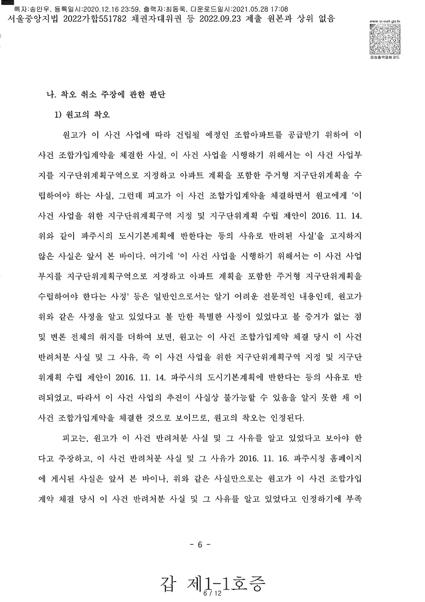

<details><summary>GW parser output</summary>

```markdown
엄성출력용범코드

### 나. 착오 취소 주장에 관한 판단

## 1 ) 원고의 착오

원고가 이 사건 사업에 따라 건립될 예정인 조합아파트를 공급받기 위하여 이 사건 조합가입계약을 체결한 사실, 이 사건 사업을 시행하기 위해서는 이 사건 사업부지를 지구단위계획구역으로 지정하고 아파트 계획을 포함한 주거형 지구단위계획을 수립하여야 하는 사실, 그런데 피고가 이 사건 조합가입계약을 체결하면서 원고에게 '이 사건 사업을 위한 지구단위계획구역 지정 및 지구단위계획 수립 제안이 2016. 11. 14. 위와 같이 파주시의 도시기본계획에 반한다는 등의 사유로 반려된 사실'을 고지하지 않은 사실은 앞서 본 바이다. 여기에 '이 사건 사업을 시행하기 위해서는 이 사건 사업부지를 지구단위계획구역으로 지정하고 아파트 계획을 포함한 주거형 지구단위계획을 수립하여야 한다는 사정' 등은 일반인으로서는 알기 어려운 전문적인 내용인데, 원고가 위와 같은 사정을 알고 있었다고 볼 만한 특별한 사정이 있었다고 볼 증거가 없는 점 및 변론 전체의 취지를 더하여 보면, 원고는 이 사건 조합가입계약 체결 당시 이 사건 반려처분 사실 및 그 사유, 즉 이 사건 사업을 위한 지구단위계획구역 지정 및 지구단위계획 수립 제안이 2016. 11. 14. 파주시의 도시기본계획에 반한다는 등의 사유로 반려되었고, 따라서 이 사건 사업의 추진이 사실상 불가능할 수 있음을 알지 못한 채 이 사건 조합가입계약을 체결한 것으로 보이므로, 원고의 착오는 인정된다.

피고는, 원고가 이 사건 반려처분 사실 및 그 사유를 알고 있었다고 보아야 한다고 주장하고, 이 사건 반려처분 사실 및 그 사유가 2016. 11. 16. 파주시청 홈페이지에 게시된 사실은 앞서 본 바이나, 위와 같은 사실만으로는 원고가 이 사건 조합가입 계약 체결 당시 이 사건 반려처분 사실 및 그 사유를 알고 있었다고 인정하기에 부족

갑 제1-1호증
```
</details>

<details><summary>VL parser output</summary>

```markdown
## 나. 착오 취소 주장에 관한 판단

#### 1) 원고의 착오

원고가 이 사건 사업에 따라 건립될 예정인 조합아파트를 공급받기 위하여 이 사건 조합가입계약을 체결한 사실, 이 사건 사업을 시행하기 위해서는 이 사건 사업부지를 지구단위계획구역으로 지정하고 아파트 계획을 포함한 주거형 지구단위계획을 수립하여야 하는 사실, 그런데 피고가 이 사건 조합가입계약을 체결하면서 원고에게 '이 사건 사업을 위한 지구단위계획구역 지정 및 지구단위계획 수립 제안이 2016. 11. 14. 위와 같이 파주시의 도시기본계획에 반한다는 등의 사유로 반려된 사실'을 고지하지 않은 사실은 앞서 본 바이다. 여기에 '이 사건 사업을 시행하기 위해서는 이 사건 사업부지를 지구단위계획구역으로 지정하고 아파트 계획을 포함한 주거형 지구단위계획을 수립하여야 한다는 사정' 등은 일반인으로서도 알기 어려운 전문적인 내용인데, 원고가 위와 같은 사정을 알고 있었다고 볼 만한 특별한 사정이 있었다고 볼 증거가 없는 점 및 변론 전체의 취지를 더하여 보면, 원고는 이 사건 조합가입계약 체결 당시 이 사건 반려처분 사실 및 그 사유, 즉 이 사건 사업을 위한 지구단위계획구역 지정 및 지구단위계획 수립 제안이 2016. 11. 14. 파주시의 도시기본계획에 반한다는 등의 사유로 반려되었고, 따라서 이 사건 사업의 추진이 사실상 불가능할 수 있음을 알지 못한 채 이 사건 조합가입계약을 체결한 것으로 보이므로, 원고의 착오는 인정된다.

피고는, 원고가 이 사건 반려처분 사실 및 그 사유를 알고 있었다고 보아야 한다고 주장하고, 이 사건 반려처분 사실 및 그 사유가 2016. 11. 16. 파주시청 홈페이지에 게시된 사실은 앞서 본 바이나, 위와 같은 사실만으로는 원고가 이 사건 조합가입계약 체결 당시 이 사건 반려처분 사실 및 그 사유를 알고 있었다고 인정하기에 부족

갑 제1-1호증
```
</details>

## I10 · source index 10 · original p34

- current original-grounded analysis: **GW `RETRIEVAL_PASS / MINOR_ERROR` · VL `RETRIEVAL_PASS / CRITICAL_ERROR / HALLUCINATION_CONFIRMED` · winner `GW` · `VL_BENEFICIAL=false`**
- comparison evidence: 원본 `제4조 ③항`을 VL이 `제4조 ⑨항`으로 변경하고 Cyrillic `m`을 생성.
- current v1: `accept_gw` — no hard-fail reason
- chars: GW 1028 / VL 1002 · errors: GW `-'` / VL `-'`
- exact input: [`page_images/I10_01_세종시_대평동_관토신_서울중앙_분양대금등반환_소미영_소장_pdf_p34.jpg`](page_images/I10_01_세종시_대평동_관토신_서울중앙_분양대금등반환_소미영_소장_pdf_p34.jpg) · sha256 `0f708a6f6122191669962f724e6f153f6bf37eb29f5d21ebd038ff775a5a4686`

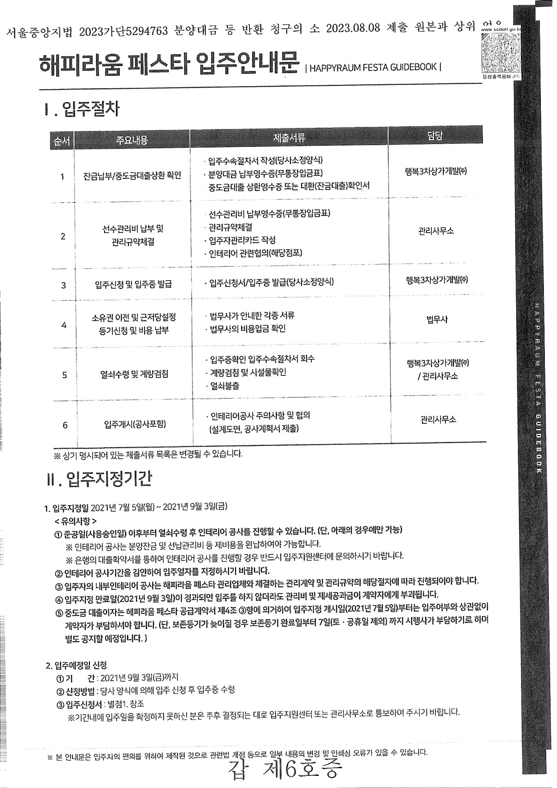

<details><summary>GW parser output</summary>

```markdown
### 1. 입주절차


<table border=1 style='margin: auto; word-wrap: break-word;'><tr><td style='text-align: center; word-wrap: break-word;'>순서</td><td style='text-align: center; word-wrap: break-word;'>주요내용</td><td style='text-align: center; word-wrap: break-word;'>제출서류</td><td style='text-align: center; word-wrap: break-word;'>담당</td></tr><tr><td style='text-align: center; word-wrap: break-word;'>1</td><td style='text-align: center; word-wrap: break-word;'>잔금납부/중도금대출상환 확인</td><td style='text-align: center; word-wrap: break-word;'>· 입주수속절차서 작성(당사소정양식)\n· 분양대금 납부영수증(무통장입금표)\n· 중도금대출 상환영수증 또는 대환(잔금대출)확인서</td><td style='text-align: center; word-wrap: break-word;'>행복3차상가개발(쑤)</td></tr><tr><td style='text-align: center; word-wrap: break-word;'>2</td><td style='text-align: center; word-wrap: break-word;'>선수관리비 납부 및 관리규약체결</td><td style='text-align: center; word-wrap: break-word;'>· 선수관리비 납부영수증(무통장입금표)\n· 관리규약체결\n· 입주자관리카드 작성\n· 인테리어 관련협의(해당점포)</td><td style='text-align: center; word-wrap: break-word;'>관리사무소</td></tr><tr><td style='text-align: center; word-wrap: break-word;'>3</td><td style='text-align: center; word-wrap: break-word;'>입주신청 및 입주중 발급</td><td style='text-align: center; word-wrap: break-word;'>· 입주신청서/입주중 발급(당사소정양식)</td><td style='text-align: center; word-wrap: break-word;'>행복3차상가개발(쑤)</td></tr><tr><td style='text-align: center; word-wrap: break-word;'>4</td><td style='text-align: center; word-wrap: break-word;'>소유권 이전 및 근거당설정 등기신청 및 비용 납부</td><td style='text-align: center; word-wrap: break-word;'>· 법무사가 안내한 각종 서류\n· 법무사의 비용입금 확인</td><td style='text-align: center; word-wrap: break-word;'>법무사</td></tr><tr><td style='text-align: center; word-wrap: break-word;'>5</td><td style='text-align: center; word-wrap: break-word;'>열쇠수령 및 계량검참</td><td style='text-align: center; word-wrap: break-word;'>· 입주중확인 입주수속절차서 회수\n· 계량검참 및 시설물확인\n· 열쇠불출</td><td style='text-align: center; word-wrap: break-word;'>행복3차상가개발(쑤)\n/ 관리사무소</td></tr><tr><td style='text-align: center; word-wrap: break-word;'>6</td><td style='text-align: center; word-wrap: break-word;'>입주개시(공사포함)</td><td style='text-align: center; word-wrap: break-word;'>· 인테리어공사 주의사항 및 협의\n(설계도면, 공사계획서 제출)</td><td style='text-align: center; word-wrap: break-word;'>관리사무소</td></tr></table>

※상기 명시되어 있는 제출서류 목록은 변경될 수 있습니다.

### Ⅱ.입주지정기간

1. 입주지점일 2021년 7월 5일(월) ~ 2021년 9월 3일(금)

<유의사항>

①준공일(사용승인일) 이후부터 열쇠수령 후 인테리어 공사를 진행할 수 있습니다. (단, 아래의 경우에만 가능)

※ 인테리어 공사는 분양잔금 및 선납관리비 등 제비용을 완납하여야 가능합니다.

※ 은행의 대출확약서를 통하여 인테리어 공사를 진행할 경우 반드시 입주지원센터에 문의하시기 바랍니다.

②인테리어 공사기간을 감안하여 입주일자를 지정하시기 바랍니다.

③ 입주자의 내부인테리어 공사는 해피라움 페스타 관리업체와 체결하는 관리계약 및 관리규약의 해당절차에 따라 진행되어야 합니다.

④ 입주지정 만료일(2021년 9월 3일)이 경과되면 입주를 하지 않더라도 관리비 및 제세공과금이 계약자에게 부과됩니다.

⑤ 중도금 대출이자는 해피라움 패스타 공급제약서 제4조 ③항에 의거하여 입주지정 개시일(2021년 7월 5일)부터는 입주어부와 상관없이 개약자가 부담하셔야 합니다. (단, 보존등기가 늦어질 경우 보존등기 완료일부터 7일(토 · 공휴일 제외) 까지 시행사가 부담하기로 하며 별도 공지할 예정입니다.)

2. 입주예정일 신청

①기 간:2021년 9월 3일(금)까지

② 신청방법: 당사 양식에 의해 입주 신청 후 입주증 수령

③ 입주신청서: 별점1. 참조

※기간내에 입주일을 확정하지 못하신 분은 추후 결정되는 데로 입주지원센터 또는 관리사무소로 통보하여 주시기 비랍니다.

※본 안내문은 입주자의 편의를 위하여 제작된 것으로 관련법 개정 등으로 일부 내용의 변경 및 인쇄성 오류가 있을 수 있습니다.

갑 제6호증
```
</details>

<details><summary>VL parser output</summary>

```markdown
# 해피라우م 페스타 입주안내문 | HAPPYRAUM FESTA GUIDEBOOK |

## I. 입주절차

<table><thead><tr><th>순서</th><th>주요내용</th><th>제출서류</th><th>담당</th></tr></thead><tbody><tr><td>1</td><td>잔금납부/중도금대출상환 확인</td><td>• 입주수속절차서 작성 (당사소정양식)<br>• 분양대금 납부영수증 (무통장입금표)<br>• 중도금대출 상환영수증 또는 대환 (잔금대출)확인서</td><td>행복3차상가개발㈜</td></tr><tr><td>2</td><td>선수관리비 납부 및 관리규약체결</td><td>• 선수관리비 납부영수증 (무통장입금표)<br>• 관리규약체결<br>• 입주자관리카드 작성<br>• 인테리어 관련협의 (해당점포)</td><td>관리사무소</td></tr><tr><td>3</td><td>입주신청 및 입주증 발급</td><td>• 입주신청서/입주증 발급 (당사소정양식)</td><td>행복3차상가개발㈜</td></tr><tr><td>4</td><td>소유권 이전 및 근저당설정 등기신청 및 비용 납부</td><td>• 법무사가 안내한 각종 서류<br>• 법무사의 비용입금 확인</td><td>법무사</td></tr><tr><td>5</td><td>열쇠수령 및 계량검침</td><td>• 입주증확인 입주수속절차서 회수<br>• 계량검침 및 시설물확인<br>• 열쇠발출</td><td>행복3차상가개발㈜<br>/ 관리사무소</td></tr><tr><td>6</td><td>입주개시 (공사포함)</td><td>• 인테리어공사 주의사항 및 협의<br>(설계도면, 공사계획서 제출)</td><td>관리사무소</td></tr></tbody></table>

※ 상기 명시되어 있는 제출서류 목록은 변경될 수 있습니다.

## II. 입주지정기간

### 1. 입주지정일 2021년 7월 5일 (월) ~ 2021 년 9 월 3 일 (금)

#### < 유의사항 >

① 준공일 (사용승인일) 이후부터 열쇠수령 후 인테리어 공사를 진행할 수 있습니다. (단, 아래의 경우에만 가능)
- ※ 인테리어 공사는 분양잔금 및 선납관리비 등 제비용을 완납하여야 가능합니다.
- ※ 은행의 대출확약서를 통하여 인테리어 공사를 진행할 경우 반드시 입주지원센터에 문의하시기 바랍니다.

② 인테리어 공사기간을 감안하여 입주일자를 지정하시기 바랍니다.

③ 입주자의 내부인테리어 공사는 해피라우м 페스타 관리업체와 체결하는 관리계약 및 관리규약의 해당절차에 따라 진행되어야 합니다.

④ 입주지정 만료일 (2021 년 9 월 3 일) 이 경과되면 입주를 하지 않더라도 관리비 및 제세공과금이 계약자에게 부과됩니다.

⑤ 중도금 대출이자는 해피라우м 페스타 공급계약서 제4 조 ⑨항에 의거하여 입주지정 개시일 (2021 년 7 월 5 일) 부터는 입주여부와 상관없이 계약자가 부담하셔야 합니다. (단, 보존등기가 늦어질 경우 보존등기 완료일부터 7 일 (토·공휴일 제외) 까지 시행사가 부담하기로 하며 별도 공지할 예정입니다.)

### 2. 입주예정일 신청

① 기 간: 2021 년 9 월 3 일 (금) 까지
② 신청방법: 당사 양식에 의해 입주 신청 후 입주증 수령
③ 입주신청서 : 별첨1. 참조

※ 기간내에 입주일을 확정하지 못하신 분은 추후 결정되는 대로 입주지원센터 또는 관리사무소로 통보하여 주시기 바랍니다.

갑 제6 호증
```
</details>

## I14 · source index 14 · original p31

- current original-grounded analysis: **GW `RETRIEVAL_PASS / CRITICAL_ERROR` · VL retry-01 `RETRIEVAL_PASS / NO_MATERIAL_ERROR` · winner `VL` · `VL_BENEFICIAL=true`**
- comparison evidence: 원본 자본금 `1,000,000`; GW `1,000.000`; VL retry는 `1,000,000` 보존.
- current v1: `accept_gw` — no hard-fail reason
- initial run metrics (history): GW 641 chars / VL 0 chars · errors: GW `-'` / VL `empty'`; 현행 비교는 위 VL retry-01 판정과 아래 전문 사용
- VL empty retry-01: **1,395 chars · `RETRIEVAL_PASS` · `VL_BENEFICIAL=true`** —
  자본금 `1,000,000`을 보존해 GW의 `1,000.000` critical numeric error를 복구.
  [retry output](retries/vl-empty-retry-01/normalized/I14_01_고양시_향동동_관토신_서울중앙_기타_금전_정재석외2_소장_pdf_p31_vl.md) ·
  [raw](retries/vl-empty-retry-01/vl_raw/I14_01_고양시_향동동_관토신_서울중앙_기타_금전_정재석외2_소장_pdf_p31.json)

- exact input: [`page_images/I14_01_고양시_향동동_관토신_서울중앙_기타_금전_정재석외2_소장_pdf_p31.jpg`](page_images/I14_01_고양시_향동동_관토신_서울중앙_기타_금전_정재석외2_소장_pdf_p31.jpg) · sha256 `4156325dba99a65beda2576dee32106c5a8acc5b6761b4105e872bb466eb5752`

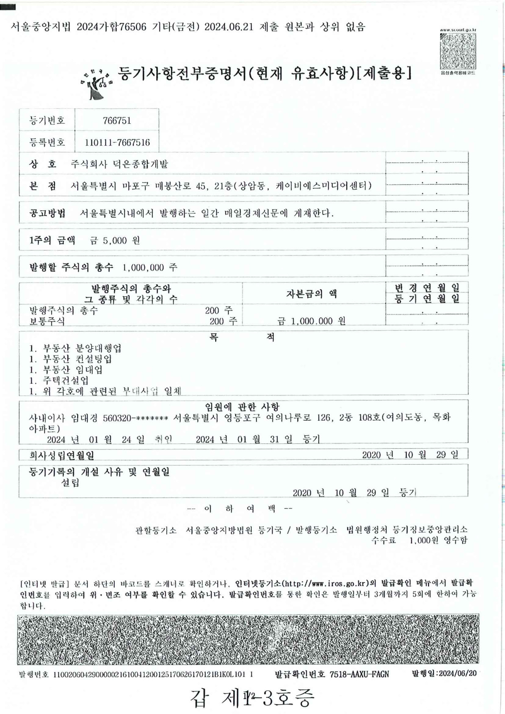

<details><summary>GW parser output</summary>

```markdown
# 등기사항전부중명서(현재 유효사항)[제출용]

음성촌력용비코드


<table border=1 style='margin: auto; word-wrap: break-word;'><tr><td style='text-align: center; word-wrap: break-word;'>등기변호</td><td style='text-align: center; word-wrap: break-word;'>766751</td><td rowspan="2" colspan="2"></td></tr><tr><td style='text-align: center; word-wrap: break-word;'>등록번호</td><td style='text-align: center; word-wrap: break-word;'>110111-7667516</td></tr><tr><td colspan="2">상 호 주식회사 덕은종합개발</td><td colspan="2"></td></tr><tr><td colspan="2">본 점 서울특별시 마포구 매봉산로 45, 21층(상암동, 케이비에스미디어센터)</td><td colspan="2"></td></tr><tr><td colspan="2">공고방법 서울특별시내에서 발행하는 일간 매일경제신문에 게재한다.</td><td colspan="2"></td></tr><tr><td colspan="2">1주의 금액 금 5,000 원</td><td colspan="2"></td></tr><tr><td colspan="2">발행할 주식의 총수 1,000,000 주</td><td colspan="2"></td></tr><tr><td colspan="2">발행주식의 총수와 그 종류 및 각각의 수</td><td style='text-align: center; word-wrap: break-word;'>자본금의 액</td><td style='text-align: center; word-wrap: break-word;'>변경 연 월 일\n등기 연 월 일</td></tr><tr><td style='text-align: center; word-wrap: break-word;'>발행주식의 총수</td><td style='text-align: center; word-wrap: break-word;'>200 주</td><td rowspan="2">금 1,000.000 원</td><td style='text-align: center; word-wrap: break-word;'></td></tr><tr><td style='text-align: center; word-wrap: break-word;'>보통주식</td><td style='text-align: center; word-wrap: break-word;'>200 주</td><td style='text-align: center; word-wrap: break-word;'></td></tr><tr><td colspan="4">목 적</td></tr><tr><td colspan="4">1. 부동산 분양대행업</td></tr><tr><td colspan="4">1. 부동산 컨설팅업</td></tr><tr><td colspan="4">1. 부동산 입대업</td></tr><tr><td colspan="4">1. 주택건설업</td></tr><tr><td colspan="4">1. 위 각호에 관련된 부대사업 일체</td></tr><tr><td colspan="4">임원에 관한 사항</td></tr><tr><td colspan="4">사내이사 임대경 560320-****** 서울특별시 영등포구 여의나루로 126, 2동 108호(여의도동, 목화아파트)</td></tr><tr><td colspan="2">2024 년 01 월 24 일 취인</td><td colspan="2">2024 년 01 월 31 일 등기</td></tr><tr><td colspan="2">회사성립연월일</td><td colspan="2">2020 년 10 월 29 일</td></tr><tr><td colspan="2">등기기록의 개설 사유 및 연월일\n설립</td><td colspan="2">2020 년 10 월 29 일 등기</td></tr></table>

-- 이 하 여 백 --

관할등기소 서울중앙지방법원 등기국/발행등기소 법원행정처 등기징보중앙관리소 수수료 1,000원 영수함

[인터넷 발급] 문서 하단의 바코드를 스캐너로 확인하거나, 인터넷등기소(http://www.iros.go.kr)의 발급확인 메뉴에서 발급확인번호를 입력하여 위·변조 여부를 확인할 수 있습니다. 발급확인번호를 통한 확인은 발행일부터 3개월까지 5회에 한하여 가능합니다.

<div style="text-align: center;"></div>


발급확인번호 7518-AAXU-FAGN

발행일:2024/06/20


갑 제12-3호증
```
</details>

<details><summary>VL parser output — retry-01 (current reviewed output)</summary>

```markdown
서울중앙지법 2024가합76506 기타(금전) 2024.06.21 제출 원본과 상위 없음

# 등기사항전부증명서(현재 유효사항)[제출용]

<table><tr><td>등기번호</td><td>766751</td></tr><tr><td>등록번호</td><td>110111-7667516</td></tr><tr><td>상 호</td><td>주식회사 덕은종합개발</td></tr><tr><td>본 점</td><td>서울특별시 마포구 매봉산로 45, 21층(상암동, 케이비에스미디어센터)</td></tr><tr><td>공고방법</td><td>서울특별시내에서 발행하는 일간 매일경제신문에 게재한다.</td></tr><tr><td>1주의 금액</td><td>금 5,000 원</td></tr><tr><td>발행할 주식의 총수</td><td>1,000,000 주</td></tr><tr><th colspan="2">발행주식의 총수와<br>그 종류 및 각각의 수</th><th>자본금의 액</th><th>변경연월일<br>등기연월일</th></tr><tr><td colspan="2">발행주식의 총수 200 주<br>보통주식 200 주</td><td>금 1,000,000 원</td><td></td></tr></table>

<table><tr><th colspan="2">목 적</th></tr><tr><td colspan="2">1. 부동산 분양대행업<br>1. 부동산 컨설팅업<br>1. 부동산 임대업<br>1. 주택건설업<br>1. 위 각호에 관련된 부대사업 일체</td></tr></table>

<table><tr><th colspan="2">임원에 관한 사항</th></tr><tr><td colspan="2">사내이사 임대경 560320-******* 서울특별시 영등포구 여의나루로 126, 2동 108호(여의도동, 목화아파트)</td></tr><tr><td>2024 년 01 월 24 일 취임</td><td>2024 년 01 월 31 일 등기</td></tr></table>

<table><tr><td>회사성립연월일</td><td>2020 년 10 월 29 일</td></tr></table>

<table><tr><th colspan="2">등기기록의 개설 사유 및 연월일</th></tr><tr><td colspan="2">설립</td></tr><tr><td colspan="2" style="text-align:right;">2020 년 10 월 29 일 등기</td></tr></table>

-- 이 하 여 백 --

관할등기소 서울중앙지방법원 등기국 / 발행등기소 법원행정처 등기정보중앙관리소
수수료 1,000원 영수함

[인터넷 발급] 문서 하단의 바코드를 스캐너로 확인하거나, 인터넷등기소(http://www.iros.go.kr)의 발급확인 메뉴에서 발급확인번호를 입력하여 위·변조 여부를 확인할 수 있습니다. 발급확인번호를 통한 확인은 발행일로부터 3개월까지 5회에 한하여 가능합니다.

발행번호 110020604290000021610041200125170626170121B1K0L101 1 발급확인번호 7518-AAXU-FAGN 발행일:2024/06/20

갑 제1-3호증
```
</details>

## I17 · source index 17 · original p52

- current original-grounded analysis: **GW `RETRIEVAL_BORDERLINE / CRITICAL_ERROR` · VL retry-01 `RETRIEVAL_PASS / NO_MATERIAL_ERROR` · winner `VL` · `VL_BENEFICIAL=true`**
- comparison evidence: VL retry가 사업목적 용어와 날짜를 복구. 말소/추가 이력의 표 구조는 평탄화됐지만 검색 의미는 유지.
- current v1: `accept_gw` — no hard-fail reason
- initial run metrics (history): GW 1741 chars / VL 0 chars · errors: GW `-'` / VL `empty'`; 현행 비교는 위 VL retry-01 판정과 아래 전문 사용
- VL empty retry-01: **3,960 chars · `RETRIEVAL_PASS` · `VL_BENEFICIAL=true`** —
  사업목적 용어와 날짜를 보존해 GW의 광범위한 term corruption을 복구. 말소/추가 이력은
  표 열로 평탄화됐지만 검색 의미는 유지됨.
  [retry output](retries/vl-empty-retry-01/normalized/I17_01_시흥시_장현지구_분관신_대리사무_수원지법_성남지원_납입금_반환_등_청구의_소_박은_p52_vl.md) ·
  [raw](retries/vl-empty-retry-01/vl_raw/I17_01_시흥시_장현지구_분관신_대리사무_수원지법_성남지원_납입금_반환_등_청구의_소_박은_p52.json)

- exact input: [`page_images/I17_01_시흥시_장현지구_분관신_대리사무_수원지법_성남지원_납입금_반환_등_청구의_소_박은_p52.jpg`](page_images/I17_01_시흥시_장현지구_분관신_대리사무_수원지법_성남지원_납입금_반환_등_청구의_소_박은_p52.jpg) · sha256 `071d5b6a391a17cfb3357678e4eb403a821f361e62b8a3cbff5a71269d6e78d1`

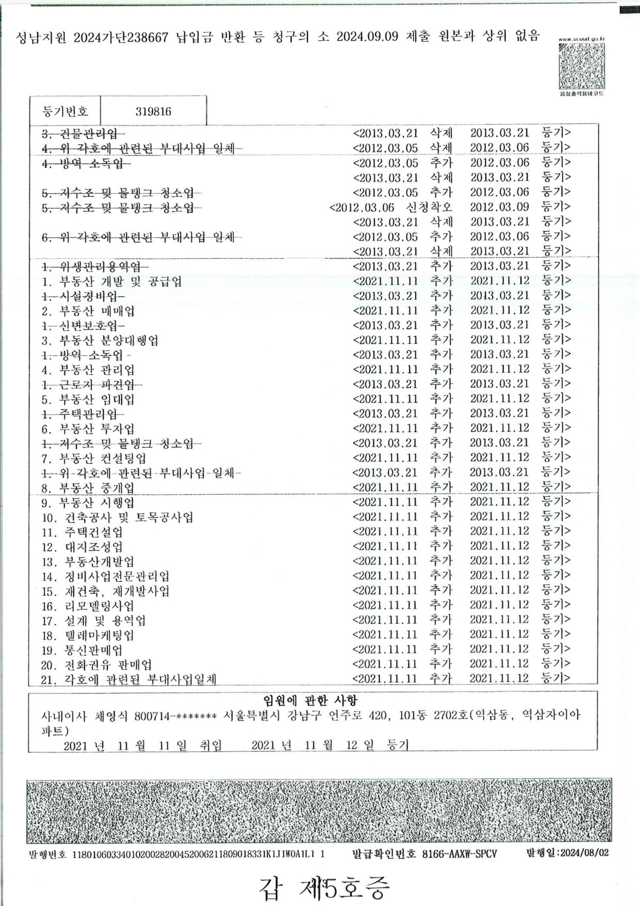

<details><summary>GW parser output</summary>

```markdown
성남지원 2024가단238667 납입금 반환 등 청구의 소 2024.09.09 제출 원본과 상위 없음

<div style="text-align: center;"></div>


음성출력용바코드


<table border=1 style='margin: auto; word-wrap: break-word;'><tr><td style='text-align: center; word-wrap: break-word;'>3. 전들관리업</td><td style='text-align: center; word-wrap: break-word;'>&lt;2013.03.21 삭제</td><td style='text-align: center; word-wrap: break-word;'>2013.03.21 둥기&gt;</td></tr><tr><td style='text-align: center; word-wrap: break-word;'>4. 위 각호에 관련된 부대사업 일체</td><td style='text-align: center; word-wrap: break-word;'>&lt;2012.03.05 삭제</td><td style='text-align: center; word-wrap: break-word;'>2012.03.06 둥기&gt;</td></tr><tr><td style='text-align: center; word-wrap: break-word;'>4. 방역 소독업</td><td style='text-align: center; word-wrap: break-word;'>&lt;2012.03.05 추가</td><td style='text-align: center; word-wrap: break-word;'>2012.03.06 둥기&gt;</td></tr><tr><td style='text-align: center; word-wrap: break-word;'></td><td style='text-align: center; word-wrap: break-word;'>&lt;2013.03.21 삭제</td><td style='text-align: center; word-wrap: break-word;'>2013.03.21 둥기&gt;</td></tr><tr><td style='text-align: center; word-wrap: break-word;'>5. 저수조 및 물탱크 청소업</td><td style='text-align: center; word-wrap: break-word;'>&lt;2012.03.05 추가</td><td style='text-align: center; word-wrap: break-word;'>2012.03.06 둥기&gt;</td></tr><tr><td style='text-align: center; word-wrap: break-word;'>5. 저수조 및 물탱크 청소업</td><td style='text-align: center; word-wrap: break-word;'>&lt;2012.03.06 신청착오</td><td style='text-align: center; word-wrap: break-word;'>2012.03.09 둥기&gt;</td></tr><tr><td style='text-align: center; word-wrap: break-word;'></td><td style='text-align: center; word-wrap: break-word;'>&lt;2013.03.21 삭제</td><td style='text-align: center; word-wrap: break-word;'>2013.03.21 둥기&gt;</td></tr><tr><td style='text-align: center; word-wrap: break-word;'>6. 위 각호에 관련된 부대사업 일체</td><td style='text-align: center; word-wrap: break-word;'>&lt;2012.03.05 추가</td><td style='text-align: center; word-wrap: break-word;'>2012.03.06 둥기&gt;</td></tr><tr><td style='text-align: center; word-wrap: break-word;'></td><td style='text-align: center; word-wrap: break-word;'>&lt;2013.03.21 삭제</td><td style='text-align: center; word-wrap: break-word;'>2013.03.21 둥기&gt;</td></tr><tr><td style='text-align: center; word-wrap: break-word;'>1. 위생관리용역업</td><td style='text-align: center; word-wrap: break-word;'>&lt;2013.03.21 추가</td><td style='text-align: center; word-wrap: break-word;'>2013.03.21 둥기&gt;</td></tr><tr><td style='text-align: center; word-wrap: break-word;'>1. 부동산 개발 및 공급업</td><td style='text-align: center; word-wrap: break-word;'>&lt;2021.11.11 추가</td><td style='text-align: center; word-wrap: break-word;'>2021.11.12 둥기&gt;</td></tr><tr><td style='text-align: center; word-wrap: break-word;'>1. 시설정비업</td><td style='text-align: center; word-wrap: break-word;'>&lt;2013.03.21 추가</td><td style='text-align: center; word-wrap: break-word;'>2013.03.21 둥기&gt;</td></tr><tr><td style='text-align: center; word-wrap: break-word;'>2. 부동산 매매업</td><td style='text-align: center; word-wrap: break-word;'>&lt;2021.11.11 추가</td><td style='text-align: center; word-wrap: break-word;'>2021.11.12 둥기&gt;</td></tr><tr><td style='text-align: center; word-wrap: break-word;'>1. 신변보호업</td><td style='text-align: center; word-wrap: break-word;'>&lt;2013.03.21 추가</td><td style='text-align: center; word-wrap: break-word;'>2013.03.21 둥기&gt;</td></tr><tr><td style='text-align: center; word-wrap: break-word;'>3. 부동산 분양대행업</td><td style='text-align: center; word-wrap: break-word;'>&lt;2021.11.11 추가</td><td style='text-align: center; word-wrap: break-word;'>2021.11.12 둥기&gt;</td></tr><tr><td style='text-align: center; word-wrap: break-word;'>1. 방역 소독업</td><td style='text-align: center; word-wrap: break-word;'>&lt;2013.03.21 추가</td><td style='text-align: center; word-wrap: break-word;'>2013.03.21 둥기&gt;</td></tr><tr><td style='text-align: center; word-wrap: break-word;'>4. 부동산 관리업</td><td style='text-align: center; word-wrap: break-word;'>&lt;2021.11.11 추가</td><td style='text-align: center; word-wrap: break-word;'>2021.11.12 둥기&gt;</td></tr><tr><td style='text-align: center; word-wrap: break-word;'>1. 근로자 편견업</td><td style='text-align: center; word-wrap: break-word;'>&lt;2013.03.21 추가</td><td style='text-align: center; word-wrap: break-word;'>2013.03.21 둥기&gt;</td></tr><tr><td style='text-align: center; word-wrap: break-word;'>5. 부동산 임대업</td><td style='text-align: center; word-wrap: break-word;'>&lt;2021.11.11 추가</td><td style='text-align: center; word-wrap: break-word;'>2021.11.12 둥기&gt;</td></tr><tr><td style='text-align: center; word-wrap: break-word;'>1. 주택관리업</td><td style='text-align: center; word-wrap: break-word;'>&lt;2013.03.21 추가</td><td style='text-align: center; word-wrap: break-word;'>2013.03.21 둥기&gt;</td></tr><tr><td style='text-align: center; word-wrap: break-word;'>6. 부동산 투자업</td><td style='text-align: center; word-wrap: break-word;'>&lt;2021.11.11 추가</td><td style='text-align: center; word-wrap: break-word;'>2021.11.12 둥기&gt;</td></tr><tr><td style='text-align: center; word-wrap: break-word;'>1. 저수조 및 물탱크 청소업</td><td style='text-align: center; word-wrap: break-word;'>&lt;2013.03.21 추가</td><td style='text-align: center; word-wrap: break-word;'>2013.03.21 둥기&gt;</td></tr><tr><td style='text-align: center; word-wrap: break-word;'>7. 부동산 건설팀업</td><td style='text-align: center; word-wrap: break-word;'>&lt;2021.11.11 추가</td><td style='text-align: center; word-wrap: break-word;'>2021.11.12 둥기&gt;</td></tr><tr><td style='text-align: center; word-wrap: break-word;'>1. 위-각호에 관련된 부대사업 일체</td><td style='text-align: center; word-wrap: break-word;'>&lt;2013.03.21 추가</td><td style='text-align: center; word-wrap: break-word;'>2013.03.21 둥기&gt;</td></tr><tr><td style='text-align: center; word-wrap: break-word;'>8. 부동산 중개업</td><td style='text-align: center; word-wrap: break-word;'>&lt;2021.11.11 추가</td><td style='text-align: center; word-wrap: break-word;'>2021.11.12 둥기&gt;</td></tr><tr><td style='text-align: center; word-wrap: break-word;'>9. 부동산 시행업</td><td style='text-align: center; word-wrap: break-word;'>&lt;2021.11.11 추가</td><td style='text-align: center; word-wrap: break-word;'>2021.11.12 둥기&gt;</td></tr><tr><td style='text-align: center; word-wrap: break-word;'>10. 건축공사 및 토목공사업</td><td style='text-align: center; word-wrap: break-word;'>&lt;2021.11.11 추가</td><td style='text-align: center; word-wrap: break-word;'>2021.11.12 둥기&gt;</td></tr><tr><td style='text-align: center; word-wrap: break-word;'>11. 주택건설업</td><td style='text-align: center; word-wrap: break-word;'>&lt;2021.11.11 추가</td><td style='text-align: center; word-wrap: break-word;'>2021.11.12 둥기&gt;</td></tr><tr><td style='text-align: center; word-wrap: break-word;'>12. 대지조성업</td><td style='text-align: center; word-wrap: break-word;'>&lt;2021.11.11 추가</td><td style='text-align: center; word-wrap: break-word;'>2021.11.12 둥기&gt;</td></tr><tr><td style='text-align: center; word-wrap: break-word;'>13. 부동산개발업</td><td style='text-align: center; word-wrap: break-word;'>&lt;2021.11.11 추가</td><td style='text-align: center; word-wrap: break-word;'>2021.11.12 둥기&gt;</td></tr><tr><td style='text-align: center; word-wrap: break-word;'>14. 정미사업전문관리업</td><td style='text-align: center; word-wrap: break-word;'>&lt;2021.11.11 추가</td><td style='text-align: center; word-wrap: break-word;'>2021.11.12 둥기&gt;</td></tr><tr><td style='text-align: center; word-wrap: break-word;'>15. 재건축, 재개발사업</td><td style='text-align: center; word-wrap: break-word;'>&lt;2021.11.11 추가</td><td style='text-align: center; word-wrap: break-word;'>2021.11.12 둥기&gt;</td></tr><tr><td style='text-align: center; word-wrap: break-word;'>16. 리모델링사업</td><td style='text-align: center; word-wrap: break-word;'>&lt;2021.11.11 추가</td><td style='text-align: center; word-wrap: break-word;'>2021.11.12 둥기&gt;</td></tr><tr><td style='text-align: center; word-wrap: break-word;'>17. 설계 및 용역업</td><td style='text-align: center; word-wrap: break-word;'>&lt;2021.11.11 추가</td><td style='text-align: center; word-wrap: break-word;'>2021.11.12 둥기&gt;</td></tr><tr><td style='text-align: center; word-wrap: break-word;'>18. 텔레마케팅업</td><td style='text-align: center; word-wrap: break-word;'>&lt;2021.11.11 추가</td><td style='text-align: center; word-wrap: break-word;'>2021.11.12 둥기&gt;</td></tr><tr><td style='text-align: center; word-wrap: break-word;'>19. 통신관매업</td><td style='text-align: center; word-wrap: break-word;'>&lt;2021.11.11 추가</td><td style='text-align: center; word-wrap: break-word;'>2021.11.12 둥기&gt;</td></tr><tr><td style='text-align: center; word-wrap: break-word;'>20. 전화권유 판매업</td><td style='text-align: center; word-wrap: break-word;'>&lt;2021.11.11 추가</td><td style='text-align: center; word-wrap: break-word;'>2021.11.12 둥기&gt;</td></tr><tr><td style='text-align: center; word-wrap: break-word;'>21. 각호에 관련된 부대사업일체</td><td style='text-align: center; word-wrap: break-word;'>&lt;2021.11.11 추가</td><td style='text-align: center; word-wrap: break-word;'>2021.11.12 둥기&gt;</td></tr></table>

<div style="text-align: center;">임원에 관한 사항</div>


<table border=1 style='margin: auto; word-wrap: break-word;'><tr><td style='text-align: center; word-wrap: break-word;'>사내이사 채영식 800714-****** 서울특별시 강남구 언주로 420, 101동 2702호(역삼동, 역삼자이아파트)</td></tr><tr><td style='text-align: center; word-wrap: break-word;'>2021 년 11 월 11 일 취임 2021 년 11 월 12 일 등기</td></tr></table>

<div style="text-align: center;"></div>


발급확인번호 8166-AAXW-SPCV

발행일:2024/08/02

갑 제5호증
```
</details>

<details><summary>VL parser output — retry-01 (current reviewed output)</summary>

```markdown
# 성남지원 2024가단238667 납입금 반환 등 청구의 소 2024.09.09 제출 원본과 상위 없음

#### 등록번호: 319816

<table><thead><tr><th>구분</th><th>일자</th><th>내용</th><th>등록일</th><th>상태</th></tr></thead><tbody><tr><td>3. 건물관리업</td><td>&lt;2013.03.21</td><td>삭제</td><td>2013.03.21</td><td>등기&gt;</td></tr><tr><td>4. 위 각호에 관련된 부대사업 일체</td><td>&lt;2012.03.05</td><td>삭제</td><td>2012.03.06</td><td>등기&gt;</td></tr><tr><td rowspan="2">4. 방역·소독업</td><td>&lt;2012.03.05</td><td>추가</td><td>2012.03.06</td><td>등기&gt;</td></tr><tr><td>&lt;2013.03.21</td><td>삭제</td><td>2013.03.21</td><td>등기&gt;</td></tr><tr><td rowspan="2">5. 저수조 및 물탱크 청소업</td><td>&lt;2012.03.05</td><td>추가</td><td>2012.03.06</td><td>등기&gt;</td></tr><tr><td>&lt;2012.03.06</td><td>신청착오</td><td>2012.03.09</td><td>등기&gt;</td></tr><tr><td rowspan="3">6. 위 각호에 관련된 부대사업 일체</td><td>&lt;2013.03.21</td><td>삭제</td><td>2013.03.21</td><td>등기&gt;</td></tr><tr><td>&lt;2012.03.05</td><td>추가</td><td>2012.03.06</td><td>등기&gt;</td></tr><tr><td>&lt;2013.03.21</td><td>삭제</td><td>2013.03.21</td><td>등기&gt;</td></tr><tr><td>1. 위생관리용역업</td><td>&lt;2013.03.21</td><td>추가</td><td>2013.03.21</td><td>등기&gt;</td></tr><tr><td>1. 부동산 개발 및 공급업</td><td>&lt;2021.11.11</td><td>추가</td><td>2021.11.12</td><td>등기&gt;</td></tr><tr><td>1. 시설경비업</td><td>&lt;2013.03.21</td><td>추가</td><td>2013.03.21</td><td>등기&gt;</td></tr><tr><td>2. 부동산 매매업</td><td>&lt;2021.11.11</td><td>추가</td><td>2021.11.12</td><td>등기&gt;</td></tr><tr><td>1. 신변보호업</td><td>&lt;2013.03.21</td><td>추가</td><td>2013.03.21</td><td>등기&gt;</td></tr><tr><td>3. 부동산 분양대행업</td><td>&lt;2021.11.11</td><td>추가</td><td>2021.11.12</td><td>등기&gt;</td></tr><tr><td>1. 방역·소독업</td><td>&lt;2013.03.21</td><td>추가</td><td>2013.03.21</td><td>등기&gt;</td></tr><tr><td>4. 부동산 관리업</td><td>&lt;2021.11.11</td><td>추가</td><td>2021.11.12</td><td>등기&gt;</td></tr><tr><td>1. 근로자 파견업</td><td>&lt;2013.03.21</td><td>추가</td><td>2013.03.21</td><td>등기&gt;</td></tr><tr><td>5. 부동산 임대업</td><td>&lt;2021.11.11</td><td>추가</td><td>2021.11.12</td><td>등기&gt;</td></tr><tr><td>1. 주택관리업</td><td>&lt;2013.03.21</td><td>추가</td><td>2013.03.21</td><td>등기&gt;</td></tr><tr><td>6. 부동산 투자업</td><td>&lt;2021.11.11</td><td>추가</td><td>2021.11.12</td><td>등기&gt;</td></tr><tr><td>1. 저수조 및 물탱크 청소업</td><td>&lt;2013.03.21</td><td>추가</td><td>2013.03.21</td><td>등기&gt;</td></tr><tr><td>7. 부동산 컨설팅업</td><td>&lt;2021.11.11</td><td>추가</td><td>2021.11.12</td><td>등기&gt;</td></tr><tr><td>1. 위 각호에 관련된 부대사업 일체</td><td>&lt;2013.03.21</td><td>추가</td><td>2013.03.21</td><td>등기&gt;</td></tr><tr><td>8. 부동산 중개업</td><td>&lt;2021.11.11</td><td>추가</td><td>2021.11.12</td><td>등기&gt;</td></tr><tr><td>9. 부동산 시행업</td><td>&lt;2021.11.11</td><td>추가</td><td>2021.11.12</td><td>등기&gt;</td></tr><tr><td>10. 건축공사 및 토목공사업</td><td>&lt;2021.11.11</td><td>추가</td><td>2021.11.12</td><td>등기&gt;</td></tr><tr><td>11. 주택건설업</td><td>&lt;2021.11.11</td><td>추가</td><td>2021.11.12</td><td>등기&gt;</td></tr><tr><td>12. 대지조성업</td><td>&lt;2021.11.11</td><td>추가</td><td>2021.11.12</td><td>등기&gt;</td></tr><tr><td>13. 부동산개발업</td><td>&lt;2021.11.11</td><td>추가</td><td>2021.11.12</td><td>등기&gt;</td></tr><tr><td>14. 정비사업전문관리업</td><td>&lt;2021.11.11</td><td>추가</td><td>2021.11.12</td><td>등기&gt;</td></tr><tr><td>15. 재건축, 재개발사업</td><td>&lt;2021.11.11</td><td>추가</td><td>2021.11.12</td><td>등기&gt;</td></tr><tr><td>16. 리모델링사업</td><td>&lt;2021.11.11</td><td>추가</td><td>2021.11.12</td><td>등기&gt;</td></tr><tr><td>17. 설계 및 용역업</td><td>&lt;2021.11.11</td><td>추가</td><td>2021.11.12</td><td>등기&gt;</td></tr><tr><td>18. 텔레마케팅업</td><td>&lt;2021.11.11</td><td>추가</td><td>2021.11.12</td><td>등기&gt;</td></tr><tr><td>19. 통신판매업</td><td>&lt;2021.11.11</td><td>추가</td><td>2021.11.12</td><td>등기&gt;</td></tr><tr><td>20. 전화권유 판매업</td><td>&lt;2021.11.11</td><td>추가</td><td>2021.11.12</td><td>등기&gt;</td></tr><tr><td>21. 각호에 관련된 부대사업일체</td><td>&lt;2021.11.11</td><td>추가</td><td>2021.11.12</td><td>등기&gt;</td></tr></tbody></table>

## 임원에 관한 사항

사내이사 채영식 800714-******* 서울특별시 강남구 언주로 420, 101동 2702호(역삼동, 역삼자이아파트)

취임: 2021 년 11 월 11 일
등기: 2021 년 11 월 12 일

발행번호: 1180106033401020028200452006211809018331K1J1W0A1L1 1
발급확인번호: 8166-AAXW-SPCV
발행일: 2024/08/02

# 갑 제5호증
```
</details>

## I18 · source index 18 · original p128

- current original-grounded analysis: **GW `RETRIEVAL_PASS / MINOR_ERROR` · VL retry-01 `RETRIEVAL_PASS / MINOR_ERROR` · winner `GW` · `VL_BENEFICIAL=false`**
- comparison evidence: 양쪽 모두 30일 답변기한과 부본 수를 보존. VL에는 `증거조기기일`, `허가하여 달리는` 등의 wording error가 있어 GW가 더 깨끗함.
- current v1: `accept_gw` — no hard-fail reason
- initial run metrics (history): GW 1388 chars / VL 0 chars · errors: GW `-'` / VL `empty'`; 현행 비교는 위 VL retry-01 판정과 아래 전문 사용
- VL empty retry-01: **1,887 chars · `RETRIEVAL_PASS` · `VL_BENEFICIAL=false`** —
  30일 답변기한과 부본 수 요구를 보존했지만 `증거조기기일`, `허가하여 달리는` 등의
  minor wording error가 있어 GW가 더 깨끗함.
  [retry output](retries/vl-empty-retry-01/normalized/I18_01_서울_서초구_관토신_책준_대구지법_계약금반환_남경은_소장_pdf_p128_vl.md) ·
  [raw](retries/vl-empty-retry-01/vl_raw/I18_01_서울_서초구_관토신_책준_대구지법_계약금반환_남경은_소장_pdf_p128.json)

- exact input: [`page_images/I18_01_서울_서초구_관토신_책준_대구지법_계약금반환_남경은_소장_pdf_p128.jpg`](page_images/I18_01_서울_서초구_관토신_책준_대구지법_계약금반환_남경은_소장_pdf_p128.jpg) · sha256 `ad2ae531ad1d9c17a47a79a29f7aaae56da9efed44fe12f923a36883f0e59797`

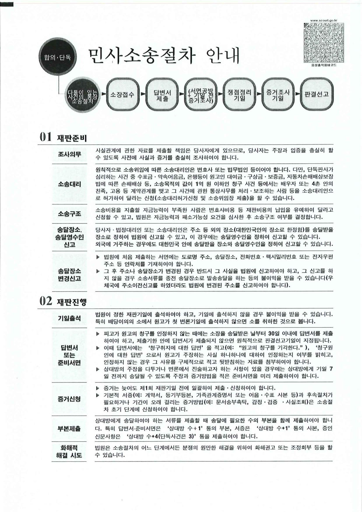

<details><summary>GW parser output</summary>

```markdown
## 민사소송절차 안내

음성총력용바코드

<div style="text-align: center;"></div>


## 01 재판준비


<table border=1 style='margin: auto; word-wrap: break-word;'><tr><td style='text-align: center; word-wrap: break-word;'>조사의무</td><td style='text-align: center; word-wrap: break-word;'>사실관계에 관한 자료를 제출할 책임은 당사자에게 있으므로, 당사자는 주장과 입증을 충실히 할 수 있도록 사전에 사실과 증거를 충실히 조사하여야 합니다.</td></tr><tr><td style='text-align: center; word-wrap: break-word;'>소송대리</td><td style='text-align: center; word-wrap: break-word;'>원칙적으로 소송위임에 따른 소송대리인은 변호사 또는 법무법인 등이어야 합니다. 다만, 단독판시가 심리하는 사건 중 수표금 · 악속어음금, 은행등이 원고인 대여금 · 구상금 · 보증금, 자동차손해배상보장법에 따른 손해배상 등, 소송목적의 값이 1억 원 이하인 청구 사건 등에서는 배우자 또는 4촌 안의 친족, 고용 등 계약관계를 맺고 그 사건에 관한 통상사무를 처리 · 보조하는 사람 등을 소송대리인으로 허가하여 달라는 신청(소송대리허가신청 및 소송위임장 제출)을 할 수 있습니다.</td></tr><tr><td style='text-align: center; word-wrap: break-word;'>소송구조</td><td style='text-align: center; word-wrap: break-word;'>소송비용을 지출할 자금능력이 부족한 사람은 변호사비용 등 재판비용의 납입을 유예하여 달라고 신청할 수 있고, 법원은 자금능력과 패소가능성 요건을 심사한 후 소송구조 여부를 결정합니다.</td></tr><tr><td style='text-align: center; word-wrap: break-word;'>송달장소, 송달영수인 신고</td><td style='text-align: center; word-wrap: break-word;'>당사자 · 법정대리인 또는 소송대리인은 주소 등 외의 장소(대한민국안의 장소로 한정함)를 송달받을 장소로 정하여 법원에 신고할 수 있고, 이 경우에는 송달영수인을 정하여 신고할 수 있습니다. 외국에 거주하는 경우에도 대한민국 안에 송달받을 장소와 송달영수인을 정하여 신고할 수 있습니다.</td></tr><tr><td style='text-align: center; word-wrap: break-word;'>송달장소 변경신고</td><td style='text-align: center; word-wrap: break-word;'>▶ 법원에 처음 제출하는 서면에는 도로명 주소, 송달장소, 전화번호 · 팩시밀리번호 또는 전자우편 주소 등 연락처를 기재하여야 합니다.
▶ 그 후 주소나 송달장소가 변경된 경우 반드시 그 사실을 법원에 신고하여야 하고, 그 신고를 하지 않을 경우 소송서류를 종전 송달장소로 발송송달을 하는 등의 불이익을 받을 수 있습니다(우체국에 주소이전신고를 하였더라도 법원에 변경된 주소를 신고하여야 합니다).</td></tr></table>

## 02 재판진행


<table border=1 style='margin: auto; word-wrap: break-word;'><tr><td style='text-align: center; word-wrap: break-word;'>기일출석</td><td style='text-align: center; word-wrap: break-word;'>법원이 성한 재판기일에 출석하여야 하고, 기일에 출석하지 않을 경우 불이익을 받을 수 있습니다. 특히 배당이의의 소에서 원고가 첫 변론기일에 출석하지 않으면 소를 취하한 것으로 봅니다.</td></tr><tr><td style='text-align: center; word-wrap: break-word;'>답변서 또는 준비서면</td><td style='text-align: center; word-wrap: break-word;'>▶ 피고가 원고의 청구를 인정하지 않는 때에는 소장을 송달받은 날부터 30일 이내에 답변서를 제출하여야 하고, 제출기한 안에 답변서가 제출되지 않으면 원칙적으로 판결선고기일이 지정됩니다. ▶ 이때 답변서에는 ‘청구취지에 대한 답변’을 적고(예: “원고의 청구를 기각한다.”), ‘청구원인에 대한 답변’으로서 원고가 주장하는 사실 하나하나에 대하여 인정하는지 여부를 밝히고, 인정하지 않는 경우 그 사유를 구체적으로 적고 뒷받침하는 자료를 첨부하여야 합니다. ▶ 상대방의 주장을 다투거나 변론에서 진술하고자 하는 사항이 있을 경우에는 상대방에게 기일 7일 전까지 송달될 수 있도록 주장과 증거방법을 적은 준비서면을 미리 제출하여야 합니다.</td></tr><tr><td style='text-align: center; word-wrap: break-word;'>증거신청</td><td style='text-align: center; word-wrap: break-word;'>▶ 증거는 늦어도 제1회 재판기일 전에 일괄하여 제출·신청하여야 합니다. ▶ 기본적 서증(예: 계약서, 등기부등본, 가족관계증명서 또는 어음·수표 사본 등)과 후속절차가 필요하거나 기간이 오래 걸리는 증거방법(예: 문서송부촉탁, 감정·검증·사실조회)은 소송절차 초기 단계에 신청하여야 합니다.</td></tr><tr><td style='text-align: center; word-wrap: break-word;'>부본제출</td><td style='text-align: center; word-wrap: break-word;'>상대방에게 송달하여야 하는 서류를 제출할 때 송달에 필요한 수의 부본을 함께 제출하여야 합니다. 특히 답변서·준비서면은 ‘상대방 수+1’ 통의 부본, 서증은 ‘상대방 수+1’ 통의 사본, 증인 신문사항은 ‘상대방 수+4(단독사건은 3)’ 통을 제출하여야 합니다.</td></tr><tr><td style='text-align: center; word-wrap: break-word;'>화해적 해결 시도</td><td style='text-align: center; word-wrap: break-word;'>법원은 소송절차의 어느 단계에서든 분쟁의 원만한 해결을 위하여 화해권고 또는 조정회부 등을 할 수 있습니다.</td></tr></table>
```
</details>

<details><summary>VL parser output — retry-01 (current reviewed output)</summary>

```markdown
# 민사소송절차 안내

## 합의·단독 소송절차 흐름
- **시작**: 다툼이 있는 소송절차
- **흐름**: 소장접수 → 답변서 제출 → (서면공방 + 기일전 증거조사) → 쟁점정리기일 → 증거조기기일 → 판결선고

<table><thead><tr><th>구분</th><th>내용</th></tr></thead><tbody><tr><td>조사의무</td><td>사실관계에 관한 자료를 제출할 책임은 당사자에게 있으므로, 당사자는 주장과 입증을 충실히 할 수 있도록 사전에 사실과 증거를 충실히 조사하여야 합니다.</td></tr><tr><td>소송대리</td><td>원칙적으로 소송위임에 따른 소송대리인은 변호사 또는 법무법인 등이어야 합니다. 다만, 단독판사가 심리하는 사건 중 수표금·약속어음금, 은행등이 원고인 대여금·구상금·보증금, 자동차손해배상보장법에 따른 손해배상 등, 소송목적의 값이 1억 원 이하인 청구 사건 등에서는 배우자 또는 4촌 안의 친족, 고용 등 계약관계를 맺고 그 사건에 관한 통상사무를 처리·보호하는 사람 등을 소송대리인으로 허가하여 달리는 신청(소송대리허가신청 및 소송위임장 제출)을 할 수 있습니다.</td></tr><tr><td>소송구조</td><td>소송비용을 지출할 자금능력이 부족한 사람은 변호사비용 등 재판비용의 납입을 유예하여 달라고 신청할 수 있고, 법원은 자금능력과 패소가능성 요건을 심사한 후 소송구조 여부를 결정합니다.</td></tr><tr><td>송달장소, 송달영수인 신고</td><td>당사자·법정대리인 또는 소송대리인은 주소 등 외의 장소(대한민국안의 장소를 한정함)를 송달받을 장소로 정하여 법원에 신고할 수 있고, 이 경우에는 송달영수인을 정하여 신고할 수 있습니다.<br>외국에 거주하는 경우에도 대한민국 안에 송달받을 장소와 송달영수인을 정하여 신고할 수 있습니다.</td></tr><tr><td>송달장소 변경신고</td><td>▶ 법원에 처음 제출하는 서면에는 도로명 주소, 송달장소, 전화번호·팩시밀리번호 또는 전자우편 주소 등 연락처를 기재하여야 합니다.<br>▶ 그 후 주소나 송달장소가 변경된 경우 반드시 그 사실을 법원에 신고하여야 하고, 그 신고를 하지 않을 경우 소송서류를 종전 송달장소로 발송송달을 하는 등의 불이익을 받을 수 있습니다(우체국에 주소이전신고를 하였더라도 법원에 변경된 주소를 신고하여야 합니다).</td></tr></tbody></table>

<table><thead><tr><th>구분</th><th>내용</th></tr></thead><tbody><tr><td>기일출석</td><td>법원이 정한 재판기일에 출석하여야 하고, 기일에 출석하지 않을 경우 불이익을 받을 수 있습니다. 특히 배당이의의 소에서 원고가 첫 변론기일에 출석하지 않으면 소를 취하한 것으로 봅니다.</td></tr><tr><td>답변서 또는 준비서면</td><td>▶ 피고가 원고의 청구를 인정하지 않는 때에는 소장을 송달받은 날부터 30일 이내에 답변서를 제출하여야 하고, 제출기한 안에 답변서가 제출되지 않으면 원칙적으로 판결선고기일이 지정됩니다.<br>▶ 이때 답변서에는 '청구취지에 대한 답변'을 적고(예: "원고의 청구를 기각한다."), '청구원인에 대한 답변'으로서 원고가 주장하는 사실 하나하나에 대하여 인정하는지 여부를 밝히고, 인정하지 않는 경우 그 사유를 구체적으로 적고 뒷받침하는 자료를 첨부하여야 합니다.<br>▶ 상대방의 주장을 다투거나 변론에서 진술하고자 하는 사항이 있을 경우에는 상대방에게 기일 7일 전까지 송달될 수 있도록 주장과 증거방법을 적은 준비서면을 미리 제출하여야 합니다.</td></tr><tr><td>증거신청</td><td>▶ 증거는 늦어도 제1회 재판기일 전에 일괄하여 제출·신청하여야 합니다.<br>▶ 기본적 서증(예: 계약서, 등기부등본, 가족관계증명서 또는 어음·수표 사본 등)과 후속절차가 필요하거나 기간이 오래 걸리는 증거방법(예: 문서송부촉탁, 감정·검증·사실조회)은 소송절차 초기 단계에 신청하여야 합니다.</td></tr><tr><td>부본제출</td><td>상대방에게 송달하여야 하는 서류를 제출할 때 송달에 필요한 수의 부본을 함께 제출하여야 합니다. 특히 답변서·준비서면은 '상대방 수+1' 통의 부본, 서증은 '상대방 수+1' 통의 사본, 증인신문사항은 '상대방 수+4(단독사건은 3)' 통을 제출하여야 합니다.</td></tr><tr><td>화해적 해결 시도</td><td>법원은 소송절차의 어느 단계에서든 분쟁의 원만한 해결을 위하여 화해권고 또는 조정회부 등을 할 수 있습니다.</td></tr></tbody></table>
```
</details>

## I19 · source index 19 · original p35

- current original-grounded analysis: **GW `RETRIEVAL_PASS / CRITICAL_ERROR` · VL `RETRIEVAL_PASS / NO_MATERIAL_ERROR` · winner `VL` · `VL_BENEFICIAL=true`**
- comparison evidence: GW `사체/부인하면/없에기/엑면금액`; VL이 원본의 `사채/부언하면/없애기/액면금액`을 복구.
- current v1: `accept_gw` — no hard-fail reason
- chars: GW 1212 / VL 1199 · errors: GW `-'` / VL `-'`
- exact input: [`page_images/I19_01_양주시_옥정동_관토신_책준_서울중앙_분양대금반환등_장성근_소장_pdf_p35.jpg`](page_images/I19_01_양주시_옥정동_관토신_책준_서울중앙_분양대금반환등_장성근_소장_pdf_p35.jpg) · sha256 `4ba852eef9680cb1e1ee59ba35866fd1ec19954f5b92dabebb23bbca03fbc5ca`

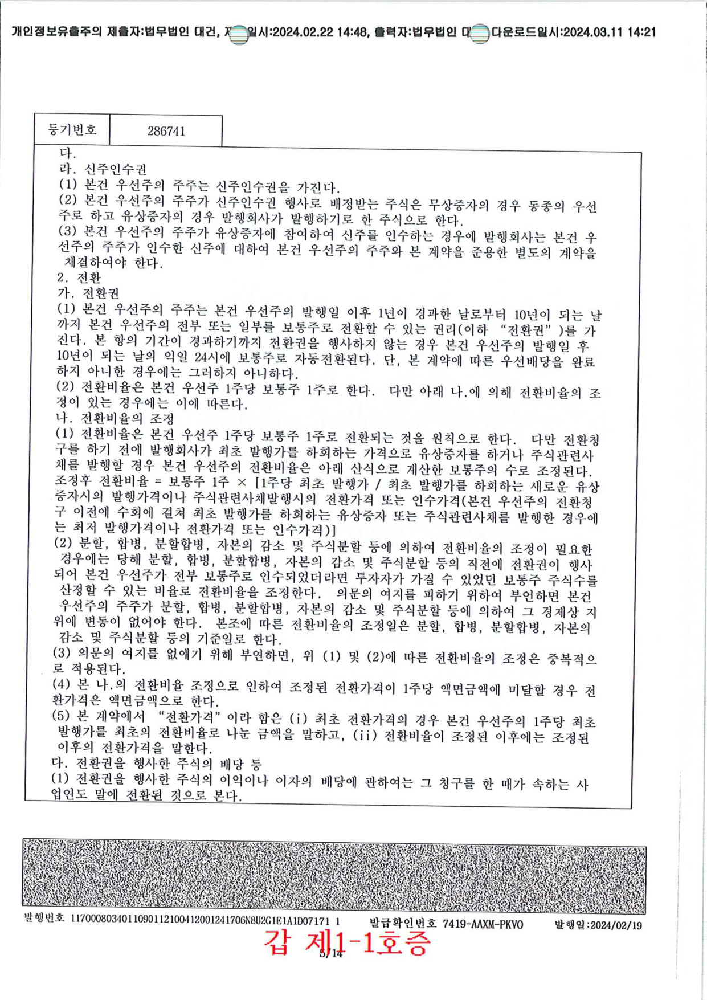

<details><summary>GW parser output</summary>

```markdown
286741

## 다

### 라.신주인수권

(1)본건 우선주의 주주는 신주인수권을 가진다.

(2) 본건 우선주의 주주가 신주인수권 행사로 배정받는 주식은 무상증자의 경우 동종의 우선주로 하고 유상증자의 경우 발행회사가 발행하기로 한 주식으로 한다.

(3) 본건 우선주의 주주가 유상증자에 참여하여 신주를 인수하는 경우에 발행회사는 본건 우선주의 주주가 인수한 신주에 대하여 본건 우선주의 주주와 본 계약을 준용한 별도의 계약을 체결하여야 한다.

### 2. 전환

### 가. 전환권

(1) 본건 우선주의 주주는 본건 우선주의 발행일 이후 1년이 경과한 날로부터 10년이 되는 날까지 본건 우선주의 전부 또는 일부를 보통주로 전환할 수 있는 권리(이하 “전환권”)를 가진다. 본 항의 기간이 경과하기까지 전환권을 행사하지 않는 경우 본건 우선주의 발행일 후 10년이 되는 날의 익일 24시에 보통주로 자동전환된다. 단, 본 계약에 따른 우선배당을 완료하지 아니한 경우에는 그러하지 아니하다.

(2) 전환비율은 본건 우선주 1주당 보통주 1주로 한다. 다만 아래 나.에 의해 전환비율의 조정이 있는 경우에는 이에 따른다.

### 나.전환비율의 조정

(1) 전환비율은 본건 우선주 1주당 보통주 1주로 전환되는 것을 원칙으로 한다. 다만 전환청구를 하기 전에 발행회사가 최초 발행가를 하회하는 가격으로 유상증자를 하거나 주식관련사체를 발행할 경우 본건 우선주의 전환비율은 아래 산식으로 계산한 보통주의 수로 조정된다. 조정후 전환비율 = 보통주 1주 × [1주당 최초 발행가 / 최초 발행가를 하회하는 새로운 유상증자시의 발행가격이나 주식관련사체발행시의 전환가격 또는 인수가격(본건 우선주의 전환청구 이전에 수회에 걸쳐 최초 발행가를 하회하는 유상증자 또는 주식관련사체를 발행한 경우에는 최저 발행가격이나 전환가격 또는 인수가격)]

(2) 분할, 합병, 분할합병, 자본의 감소 및 주식분할 등에 의하여 전환비율의 조정이 필요한 경우에는 당해 분할, 합병, 분할합병, 자본의 감소 및 주식분할 등의 직전에 전환권이 행사되어 본건 우선주가 전부 보통주로 인수되었더라면 투자자가 가질 수 있었던 보통주 주식수를 산정할 수 있는 비율로 전환비율을 조정한다. 의문의 여지를 피하기 위하여 부인하면 본건 우선주의 주주가 분할, 합병, 분할합병, 자본의 감소 및 주식분할 등에 의하여 그 경제상 지위에 변동이 없어야 한다. 본조에 따른 전환비율의 조정일은 분할, 합병, 분할합병, 자본의 감소 및 주식분할 등의 기준일로 한다.

## (3) 의문의 여지를 없에기 위해 부연하면, 위 (1) 및 (2)에 따른 전환비율의 조정은 중복적으로 적용된다

(4) 본 나.의 전환비율 조정으로 인하여 조정된 전환가격이 1주당 액면금액에 미달할 경우 전환가격은 엑면금액으로 한다.

(5) 본 계약에서 “전환가격”이라 함은 (i) 최초 전환가격의 경우 본건 우선주의 1주당 최초 발행가를 최초의 전환비율로 나눈 금액을 말하고, (ii) 전환비율이 조정된 이후에는 조정된 이후의 전환가격을 말한다.

### 다.전환권을 행사한 주식의 배당 등

(1) 전환권을 행사한 주식의 이익이나 이자의 배당에 관하여는 그 청구를 한 때가 속하는 사업연도 말에 전환된 것으로 본다.

<div style="text-align: center;"></div>

```
</details>

<details><summary>VL parser output</summary>

```markdown
<table><thead><tr><th>등기번호</th><td>286741</td></tr></thead><tbody><tr><td colspan="2"><p>다.</p><p>라. 신주인수권</p><p>(1) 본건 우선주의 주주는 신주인수권을 가진다.</p><p>(2) 본건 우선주의 주주가 신주인수권 행사로 배정받는 주식은 무상증자의 경우 동종의 우선주로 하고 유상증자의 경우 발행회사가 발행하기로 한 주식으로 한다.</p><p>(3) 본건 우선주의 주주가 유상증자에 참여하여 신주를 인수하는 경우에 발행회사는 본건 우선주의 주주가 인수한 신주에 대하여 본건 우선주의 주주와 본 계약을 준용한 별도의 계약을 체결하여야 한다.</p><h3>2. 전환</h3><h4>가. 전환권</h4><p>(1) 본건 우선주의 주주는 본건 우선주의 발행일 이후 1년이 경과한 날로부터 10년이 되는 날까지 본건 우선주의 전부 또는 일부를 보통주로 전환할 수 있는 권리(이하 “전환권”)를 가진다. 본 항의 기간이 경과하기까지 전환권을 행사하지 않는 경우 본건 우선주의 발행일 후 10년이 되는 날의 익일 24시에 보통주로 자동전환된다. 단, 본 계약에 따른 우선배당을 완료하지 아니한 경우에는 그러하지 아니하다.</p><p>(2) 전환비율은 본건 우선주 1주당 보통주 1주로 한다. 다만 아래 나.에 의한 전환비율의 조정이 있는 경우에는 이에 따른다.</p><h4>나. 전환비율의 조정</h4><p>(1) 전환비율은 본건 우선주 1주당 보통주 1주로 전환되는 것을 원칙으로 한다. 다만 전환청구를 하기 전에 발행회사가 최초 발행가를 하회하는 가격으로 유상증자를 하거나 주식관련사채를 발행할 경우 본건 우선주의 전환비율은 아래 산식으로 계산한 보통주의 수로 조정된다.<br>조정후 전환비율 = 보통주 1주 × [1주당 최초 발행가 / 최초 발행가를 하회하는 새로운 유상증자시의 발행가격이나 주식관련사채발행시의 전환가격 또는 인수가격(본건 우선주의 전환청구 이전에 수회에 걸쳐 최초 발행가를 하회하는 유상증자 또는 주식관련사채를 발행한 경우에는 최저 발행가격이나 전환가격 또는 인수가격)]</p><p>(2) 분할, 합병, 분할합병, 자본의 감소 및 주식분할 등에 의하여 전환비율의 조정이 필요한 경우에는 당해 분할, 합병, 분할합병, 자본의 감소 및 주식분할 등의 직전에 전환권이 행사되어 본건 우선주가 전부 보통주로 인수되었더라면 투자자가 가질 수 있었던 보통주 주식수를 산정할 수 있는 비율로 전환비율을 조정한다. 의문의 여지를 피하기 위하여 부언하면 본건 우선주의 주주가 분할, 합병, 분할합병, 자본의 감소 및 주식분할 등에 의하여 그 경제상 지위에 변동이 없어야 한다. 본조에 따른 전환비율의 조정일은 분할, 합병, 분할합병, 자본의 감소 및 주식분할 등의 기준일로 한다.</p><p>(3) 의문의 여지를 없애기 위해 부언하면, 위 (1) 및 (2)에 따른 전환비율의 조정은 중복적으로 적용된다.</p><p>(4) 본 나.의 전환비율 조정으로 인하여 조정된 전환가격이 1주당 액면금액에 미달할 경우 전환가격은 액면금액으로 한다.</p><p>(5) 본 계약에서 “전환가격”이라 함은 (i) 최초 전환가격의 경우 본건 우선주의 1주당 최초 발행가를 최초의 전환비율로 나눈 금액을 말하고, (ii) 전환비율이 조정된 이후에는 조정된 이후의 전환가격을 말한다.</p><h4>다. 전환권을 행사한 주식의 배당 등</h4><p>(1) 전환권을 행사한 주식의 이익이나 이자의 배당에 관하여는 그 청구를 한 때가 속하는 사업연도 말에 전환된 것으로 본다.</p></td></tr></tbody></table>
```
</details>

## I20 · source index 20 · original p41

- current original-grounded analysis: **GW `RETRIEVAL_PASS / MINOR_ERROR` · VL `RETRIEVAL_PASS / MINOR_ERROR / HALLUCINATION_SUSPECT` · winner `VL` · `VL_BENEFICIAL=false`**
- comparison evidence: VL body가 더 깨끗하지만 원본 `가처분이의`를 `가치분이의`로 변경. GW 오류가 critical이 아니어서 target 정의상 beneficial 아님.
- current v1: `accept_gw` — no hard-fail reason
- chars: GW 995 / VL 1040 · errors: GW `-'` / VL `-'`
- exact input: [`page_images/I20_01_인천시_청라동_관토신_책준_서울중앙_가처분이의_주_디벨럽팩토리_심문기일통지서_가처_p41.jpg`](page_images/I20_01_인천시_청라동_관토신_책준_서울중앙_가처분이의_주_디벨럽팩토리_심문기일통지서_가처_p41.jpg) · sha256 `99e68b21ef9b9181c4f73ea642aeb3f59a8a9b0192e376e05f03913932f7909b`

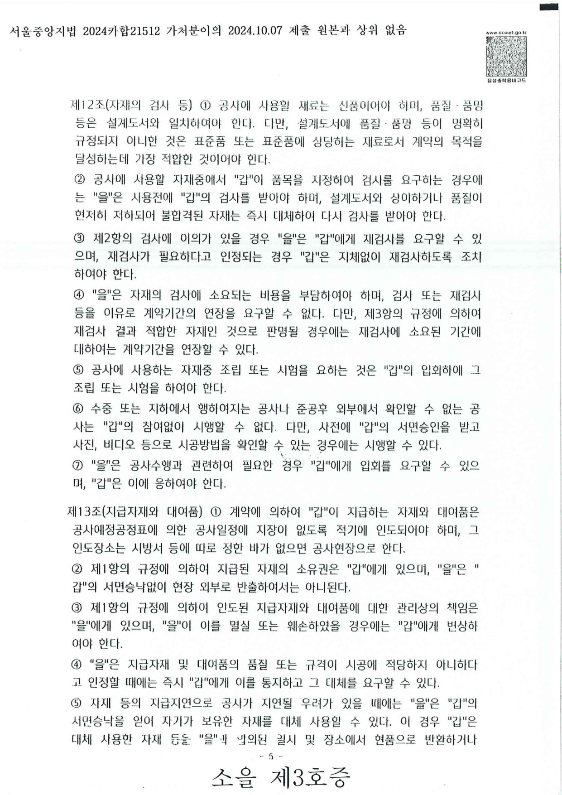

<details><summary>GW parser output</summary>

```markdown
음성출력용바코드

제12조(자재의 검사 등) ① 공사에 사용할 재료는 신품이어야 하며, 품질·품명 등은 설계도서와 일치하여야 한다. 다만, 설계도서에 품질·품명 등이 명확히 규정되지 이니한 것은 표준품 또는 표준품에 상당하는 제로로서 계약의 목적을 달성하는데 가장 적합한 것이어야 한다.

② 공사에 사용할 자제중에서 "갑"이 품목을 지정하여 검사를 요구하는 경우에는 "을"은 사용전에 "갑"의 검사를 받아야 하며, 설계도서와 상이하기가 품질이 헌저히 저하되어 불합격된 자재는 즉시 대체하여 다시 검사를 받아야 한다.

③ 제2항의 검사에 이의가 있을 경우 "을"은 "갑"에게 재검사를 요구할 수 있으며, 재검사가 필요하다고 인정되는 경우 "갑"은 지체없이 재검사하도록 조치하여야 한다.

④ "을"은 자재의 검사에 소요되는 비용을 부담하여야 하며, 검사 또는 재검사 등을 이유로 계약기간의 연장을 요구할 수 없다. 다만, 제3항의 규정에 의하여 재검사 결과 적합한 자재인 것으로 판명될 경우에는 재검사에 소요된 기간에 대하여는 계약기간을 연장할 수 있다.

⑤ 공사에 사용하는 자재중 조립 또는 시험을 요하는 것은 "갑"의 입회하에 그 조립 또는 시험을 하여야 한다.

⑥ 수중 또는 지하에서 행하여지는 공사나 준공후 외부에서 확인할 수 없는 공사는 "갑"의 참여없이 시행할 수 없다. 다만, 사전에 "갑"의 서면승인을 받고 사진, 비디오 등으로 시공방법을 확인할 수 있는 경우에는 시행할 수 있다.

⑦ "을"은 공사수행과 관련하여 필요한 경우 "갑"에게 입회를 요구할 수 있으며, "갑"은 이에 응하여야 한다.

제13조(지급자재와 대여품) ① 계약에 의하여 "갑"이 지급하는 자재와 대여품은 공사에정공정표에 의한 공사일정에 지장이 없도록 적기에 인도되어야 하며, 그 인도장소는 시방서 등에 띠로 정한 바가 없으면 공사현장으로 한다.

② 제1항의 규정에 의하여 지급된 자재의 소유권은 "갑"에게 있으며, "을"은 "갑"의 서면승낙없이 현장 외부로 반출하여서는 아니된다.

③ 제1항의 규정에 의하여 인도된 지급자재와 대여품에 대한 관리상의 책임은 "을"에게 있으며, "을"이 이를 멸실 또는 훼손하였을 경우에는 "갑"에게 번상하여야 한다.

④"을"은 지급자재 및 대여품의 품질 또는 규격이 시공에 적당하지 아니하다고 인정할 때에는 즉시 "갑"에게 이를 통지하고 그 대체를 요구할 수 있다.

⑤ 지제 등의 지급지연으로 공사가 지연될 우려가 있을 때에는 "을"은 "갑"의 서면승낙을 얻어 자기가 보유한 자재를 대체 사용할 수 있다. 이 경우 "갑"은 대체 사용한 자재 등을 "을"과 낙의된 일시 및 장소에서 현품으로 반환하거나

소을 제3호증
```
</details>

<details><summary>VL parser output</summary>

```markdown
서울중앙지법 2024카합21512 가치분이의 2024.10.07 제출 원본과 상위 없음

#### 제12조(자재의 검사 등)
① 공사에 사용할 재료는 신품이어야 하며, 품질·품명 등은 설계도서와 일치하여야 한다. 다만, 설계도서에서 품질·품명 등이 명확히 규정되지 아니한 것은 표준품 또는 표준품에 상당하는 재료로서 계약의 목적을 달성하는데 가장 적합한 것이어야 한다.
② 공사에 사용할 자재중에서 "갑"이 품목을 지정하여 검사를 요구하는 경우에는 "을"은 사용전에 "갑"의 검사를 받아야 하며, 설계도서와 상이하거나 품질이 현저히 저하되어 불합격된 자재는 즉시 대체하여 다시 검사를 받아야 한다.
③ 제2항의 검사에 이의가 있을 경우 "을"은 "갑"에게 재검사를 요구할 수 있으며, 재검사가 필요하다고 인정되는 경우 "갑"은 지체없이 재검사하도록 조치하여야 한다.
④ "을"은 자재의 검사에 소요되는 비용을 부담하여야 하며, 검사 또는 재검사 등을 이유로 계약기간의 연장을 요구할 수 없다. 다만, 제3항의 규정에 의하여 재검사 결과 적합한 자재인 것으로 판명될 경우에는 재검사에 소요된 기간에 대하여는 계약기간을 연장할 수 있다.
⑤ 공사에 사용하는 자재중 조립 또는 시험을 요하는 것은 "갑"의 입회하에 그 조립 또는 시험을 하여야 한다.
⑥ 수중 또는 지하에서 행하여지는 공사나 준공후 외부에서 확인할 수 없는 공사는 "갑"의 참여없이 시행할 수 없다. 다만, 사전에 "갑"의 서면승인을 받고 사진, 비디오 등으로 시공방법을 확인할 수 있는 경우에는 시행할 수 있다.
⑦ "을"은 공사수행과 관련하여 필요한 경우 "갑"에게 입회를 요구할 수 있으며, "갑"은 이에 응하여야 한다.

#### 제13조(지급자재와 대여품)
① 계약에 의하여 "갑"이 지급하는 자재와 대여품은 공사예정공정표에 의한 공사일정에 지장이 없도록 적기에 인도되어야 하며, 그 인도장소는 시방서 등에 따로 정한 바가 없으면 공사현장으로 한다.
② 제1항의 규정에 의하여 지급된 자재의 소유권은 "갑"에게 있으며, "을"은 "갑"의 서면승낙없이 현장 외부로 반출하여서는 아니된다.
③ 제1항의 규정에 의하여 인도된 지급자재와 대여품에 대한 관리상의 책임은 "을"에게 있으며, "을"이 이를 멸실 또는 훼손하였을 경우에는 "갑"에게 변상하여야 한다.
④ "을"은 지급자재 및 대여품의 품질 또는 규격이 시공에 적당하지 아니하다고 인정할 때에는 즉시 "갑"에게 이를 통지하고 그 대체를 요구할 수 있다.
⑤ 자재 등의 지급지연으로 공사가 지연될 우려가 있을 때에는 "을"은 "갑"의 서면승낙을 얻어 자기가 보유한 자재를 대체 사용할 수 있다. 이 경우 "갑"은 대체 사용한 자재 등을 "을"과 합의된 일시 및 장소에서 현품으로 반환하거나

- 5 -

소을 제3호증
```
</details>

## I24 · source index 24 · original p419

- current original-grounded analysis: **GW `RETRIEVAL_FAIL / CRITICAL_ERROR / SEVERE_OMISSION` · VL `RETRIEVAL_FAIL / CRITICAL_ERROR / TRUNCATED` · winner `BOTH_FAIL` · `VL_BENEFICIAL=false`**
- comparison evidence: GW는 무관한 중국어 표를 만들고 VL은 header 뒤에서 절단. 현재 v1 quarantine 대상.
- current v1: `quarantine` — 한자 오염: 한자 130자, 비율 0.54
- chars: GW 472 / VL 209 · errors: GW `-'` / VL `-'`
- exact input: [`page_images/I24_01_경산삼남지역주택조합_대리사무_대구지법_손해배상_기_강성대외95_소장_pdf_p419.jpg`](page_images/I24_01_경산삼남지역주택조합_대리사무_대구지법_손해배상_기_강성대외95_소장_pdf_p419.jpg) · sha256 `c261a6dce840347daef024a373b4a9097a442dd5c7b30ae333dc31c4109f56dd`

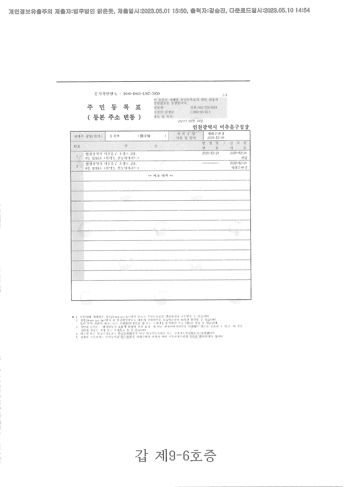

<details><summary>GW parser output</summary>

```markdown
是서학연맹호 : 1680-1803-1307-5950

# 주민등록표

# (등본 주소 변동)

<div style="text-align: center;"></div>


2021|03|301

인천광역시 미추홀구청장


<table border=1 style='margin: auto; word-wrap: break-word;'><tr><td style='text-align: center; word-wrap: break-word;'>叶绿体 结构图(图例)</td><td style='text-align: center; word-wrap: break-word;'>含氧量 (圈管厚)</td><td colspan="2">叶绿体中含氧量</td><td style='text-align: center; word-wrap: break-word;'>叶绿体中含氧量 2021-12-30</td></tr><tr><td style='text-align: center; word-wrap: break-word;'>叶绿体 厚</td><td style='text-align: center; word-wrap: break-word;'>本</td><td style='text-align: center; word-wrap: break-word;'></td><td style='text-align: center; word-wrap: break-word;'>叶绿体 厚 / 叶绿体 薄</td><td style='text-align: center; word-wrap: break-word;'></td></tr><tr><td style='text-align: center; word-wrap: break-word;'>1</td><td style='text-align: center; word-wrap: break-word;'>叶绿体结构图 (叶绿素7、总绿素211、6倍、121倍、叶绿素、总氮)</td><td style='text-align: center; word-wrap: break-word;'></td><td style='text-align: center; word-wrap: break-word;'>2021-12-20</td><td style='text-align: center; word-wrap: break-word;'>2021-12-20</td></tr><tr><td style='text-align: center; word-wrap: break-word;'>2</td><td style='text-align: center; word-wrap: break-word;'>叶绿体结构图 (叶绿素7、总绿素211、6倍、121倍、叶绿素、总氮)</td><td style='text-align: center; word-wrap: break-word;'></td><td style='text-align: center; word-wrap: break-word;'>2021-12-20</td><td style='text-align: center; word-wrap: break-word;'></td></tr><tr><td style='text-align: center; word-wrap: break-word;'></td><td style='text-align: center; word-wrap: break-word;'>叶绿体结构图 (叶绿素、总氮)</td><td style='text-align: center; word-wrap: break-word;'></td><td style='text-align: center; word-wrap: break-word;'></td><td style='text-align: center; word-wrap: break-word;'></td></tr><tr><td style='text-align: center; word-wrap: break-word;'></td><td style='text-align: center; word-wrap: break-word;'></td><td style='text-align: center; word-wrap: break-word;'></td><td style='text-align: center; word-wrap: break-word;'></td><td style='text-align: center; word-wrap: break-word;'></td></tr><tr><td style='text-align: center; word-wrap: break-word;'></td><td style='text-align: center; word-wrap: break-word;'></td><td style='text-align: center; word-wrap: break-word;'></td><td style='text-align: center; word-wrap: break-word;'></td><td style='text-align: center; word-wrap: break-word;'></td></tr><tr><td style='text-align: center; word-wrap: break-word;'></td><td style='text-align: center; word-wrap: break-word;'></td><td style='text-align: center; word-wrap: break-word;'></td><td style='text-align: center; word-wrap: break-word;'></td><td style='text-align: center; word-wrap: break-word;'></td></tr><tr><td style='text-align: center; word-wrap: break-word;'></td><td style='text-align: center; word-wrap: break-word;'></td><td style='text-align: center; word-wrap: break-word;'></td><td style='text-align: center; word-wrap: break-word;'></td><td style='text-align: center; word-wrap: break-word;'></td></tr><tr><td style='text-align: center; word-wrap: break-word;'></td><td style='text-align: center; word-wrap: break-word;'></td><td style='text-align: center; word-wrap: break-word;'></td><td style='text-align: center; word-wrap: break-word;'></td><td style='text-align: center; word-wrap: break-word;'></td></tr><tr><td style='text-align: center; word-wrap: break-word;'></td><td style='text-align: center; word-wrap: break-word;'></td><td style='text-align: center; word-wrap: break-word;'></td><td style='text-align: center; word-wrap: break-word;'></td><td style='text-align: center; word-wrap: break-word;'></td></tr><tr><td style='text-align: center; word-wrap: break-word;'></td><td style='text-align: center; word-wrap: break-word;'></td><td style='text-align: center; word-wrap: break-word;'></td><td style='text-align: center; word-wrap: break-word;'></td><td style='text-align: center; word-wrap: break-word;'></td></tr><tr><td style='text-align: center; word-wrap: break-word;'></td><td style='text-align: center; word-wrap: break-word;'></td><td style='text-align: center; word-wrap: break-word;'></td><td style='text-align: center; word-wrap: break-word;'></td><td style='text-align: center; word-wrap: break-word;'></td></tr><tr><td style='text-align: center; word-wrap: break-word;'></td><td style='text-align: center; word-wrap: break-word;'></td><td style='text-align: center; word-wrap: break-word;'></td><td style='text-align: center; word-wrap: break-word;'></td><td style='text-align: center; word-wrap: break-word;'></td></tr><tr><td style='text-align: center; word-wrap: break-word;'></td><td style='text-align: center; word-wrap: break-word;'></td><td style='text-align: center; word-wrap: break-word;'></td><td style='text-align: center; word-wrap: break-word;'></td><td style='text-align: center; word-wrap: break-word;'></td></tr><tr><td style='text-align: center; word-wrap: break-word;'></td><td style='text-align: center; word-wrap: break-word;'></td><td style='text-align: center; word-wrap: break-word;'></td><td style='text-align: center; word-wrap: break-word;'></td><td style='text-align: center; word-wrap: break-word;'></td></tr><tr><td style='text-align: center; word-wrap: break-word;'></td><td style='text-align: center; word-wrap: break-word;'></td><td style='text-align: center; word-wrap: break-word;'></td><td style='text-align: center; word-wrap: break-word;'></td><td style='text-align: center; word-wrap: break-word;'></td></tr><tr><td style='text-align: center; word-wrap: break-word;'></td><td style='text-align: center; word-wrap: break-word;'></td><td style='text-align: center; word-wrap: break-word;'></td><td style='text-align: center; word-wrap: break-word;'></td><td style='text-align: center; word-wrap: break-word;'></td></tr><tr><td style='text-align: center; word-wrap: break-word;'></td><td style='text-align: center; word-wrap: break-word;'></td><td style='text-align: center; word-wrap: break-word;'></td><td style='text-align: center; word-wrap: break-word;'></td><td style='text-align: center; word-wrap: break-word;'></td></tr><tr><td style='text-align: center; word-wrap: break-word;'></td><td style='text-align: center; word-wrap: break-word;'></td><td style='text-align: center; word-wrap: break-word;'></td><td style='text-align: center; word-wrap: break-word;'></td><td style='text-align: center; word-wrap: break-word;'></td></tr></table>

01 본문서내 대해접수 윤부참의www.gov.kr/채비 부담보 윤명송책임자 접수번호 수 절차시단

2. 2019.02.2020.02.2021.02.2022.02.2023.02.2024.02.2025.02.2026.02.2027.02.2028.02.2029.02.2020.

1. 작성의 단위는  명칭의부의 윤율적 풍량에 관한 규정에 따라 선정하며 창의성을 인쇄하는 필요성을 얻으나 이 무슨

1. 列号单位列号列号单位名称按号编号编号列号列号编号姓名姓名、电话姓名及地址、电话号码

.

갑 제9-6호증
```
</details>

<details><summary>VL parser output</summary>

```markdown
{
  "elements": [
    {
      "category": "figure",
      "content": {
        "html": "",
        "markdown": "개인정보보호주의 제출자:법무법인 맑은뜻, 제출일시:2023.05.01 15:50, 출력자:김승진, 다운로드일시:2023.05.10 14:54\n\n문서확인번호 : 1680-1803-1307-5950\n\n# 주민등록표\n## (등본 주소 변동)\n\n이 문서는 세대별 주민등록표의 일부
```
</details>

## I26 · source index 26 · original p270

- current original-grounded analysis: **GW `RETRIEVAL_BORDERLINE / CRITICAL_ERROR / PARTIAL` · VL `RETRIEVAL_PASS / NO_MATERIAL_ERROR` · winner `VL` · `VL_BENEFICIAL=true`**
- comparison evidence: GW가 피고·피항소인 B와 승계참가인 D를 누락; VL은 당사자와 금액을 보존.
- current v1: `accept_gw` — no hard-fail reason
- chars: GW 345 / VL 441 · errors: GW `-'` / VL `-'`
- exact input: [`page_images/I26_01_창원시_팔용동_관토신_서울중앙_손해배상_등_이경연외2_소장_pdf_p270.jpg`](page_images/I26_01_창원시_팔용동_관토신_서울중앙_손해배상_등_이경연외2_소장_pdf_p270.jpg) · sha256 `b430eca3848e5a0ee17e865b8d9143a799eea834ccc50699b3e6de48f468ed42`

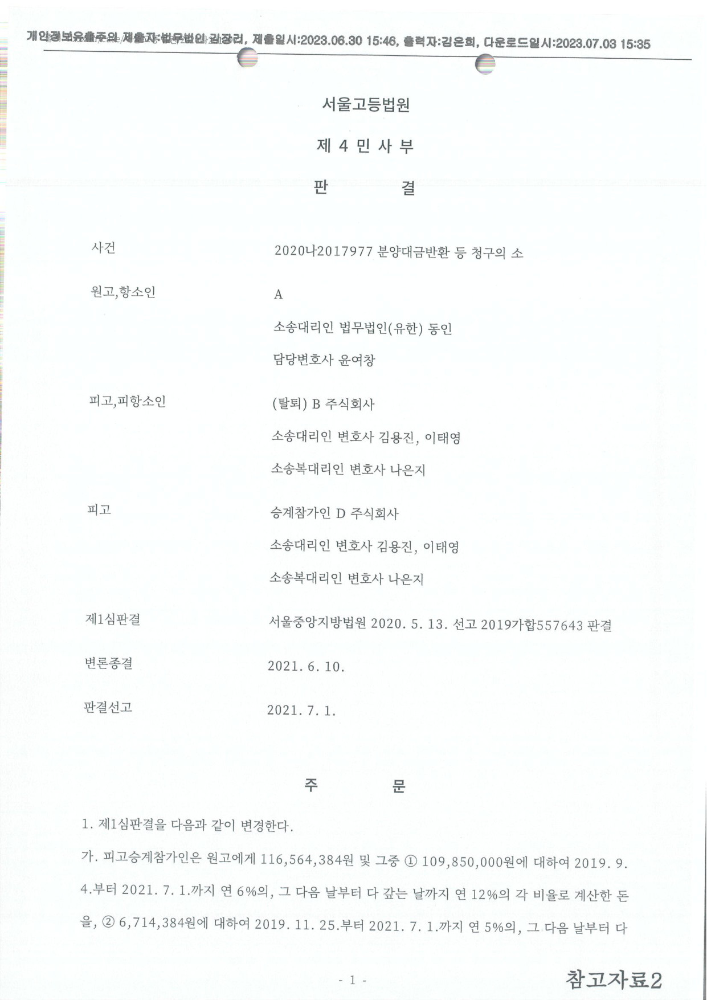

<details><summary>GW parser output</summary>

```markdown
서울고등법원

## 제 4 민 사 부

판결

사건 2020나2017977 분양대금반환 등 청구의 소

원고,항소인

## A

소송대리인 법무법인(유한) 동인

담당변호사 윤여창

피고

소송대리인 변호사 김용진, 이태영

소송복대리인 변호사 나은지

제1심판결 서울중앙지방법원 2020.5.13.선고 2019가합557643판결

변론종결 2021.6.10.

판결선고 2021.7.1.

## 주문

1. 제1심판결을 다음과 같이 변경한다.

가. 피고승계참가인은 원고에게 116,564,384원 및 그중 ① 109,850,000원에 대하여 2019. 9.

4.부터 2021. 7. 1.까지 연 6%의, 그 다음 날부터 다 갚는 날까지 연 12%의 각 비율로 계산한 돈을, ② 6,714,384원에 대하여 2019. 11. 25.부터 2021. 7. 1.까지 연 5%의, 그 다음 날부터 다

참고자료2
```
</details>

<details><summary>VL parser output</summary>

```markdown
# 서울고등법원

## 제 4 민사부

### 판결

**사건**: 2020나2017977 분양대금반환 등 청구의 소

**원고,항소인**: A
- 소송대리인 법무법인(유한) 동인
- 담당변호사 윤여창

**피고,피항소인**: (탈퇴) B 주식회사
- 소송대리인 변호사 김용진, 이태영
- 소송복대리인 변호사 나은지

**피고**: 승계참가인 D 주식회사
- 소송대리인 변호사 김용진, 이태영
- 소송복대리인 변호사 나은지

**제1심판결**: 서울중앙지방법원 2020. 5. 13. 선고 2019가합557643 판결

**변론종결**: 2021. 6. 10.

**판결선고**: 2021. 7. 1.

---

#### 주 문

1. 제1심판결을 다음과 같이 변경한다.
   가. 피고승계참가인은 원고에게 116,564,384원 및 그중 ① 109,850,000원에 대하여 2019. 9. 4.부터 2021. 7. 1.까지 연 6%의, 그 다음 날부터 다 갚는 날까지 연 12%의 각 비율로 계산한 돈을, ② 6,714,384원에 대하여 2019. 11. 25.부터 2021. 7. 1.까지 연 5%의, 그 다음 날부터 다
```
</details>

## I35 · source index 35 · original p18

- current original-grounded analysis: **GW `RETRIEVAL_BORDERLINE / CRITICAL_ERROR / PARTIAL` · VL `RETRIEVAL_PASS / NO_MATERIAL_ERROR` · winner `VL` · `VL_BENEFICIAL=true`**
- comparison evidence: GW가 사건번호 `2024가단5205920`과 문서 문맥을 누락; VL이 복구.
- current v1: `accept_gw` — 빈 페이지(ink=0.0158) — 내용 없음
- chars: GW 40 / VL 201 · errors: GW `-'` / VL `-'`
- exact input: [`page_images/I35_01_남양주시_금곡리_대리사무_서울중앙_추심금_김성수_소장_pdf_p18.jpg`](page_images/I35_01_남양주시_금곡리_대리사무_서울중앙_추심금_김성수_소장_pdf_p18.jpg) · sha256 `4b11d0cbe575fe106d2285f7e4f83c5f1d84dfe944bbf0d2dfef0d8470e2f68e`

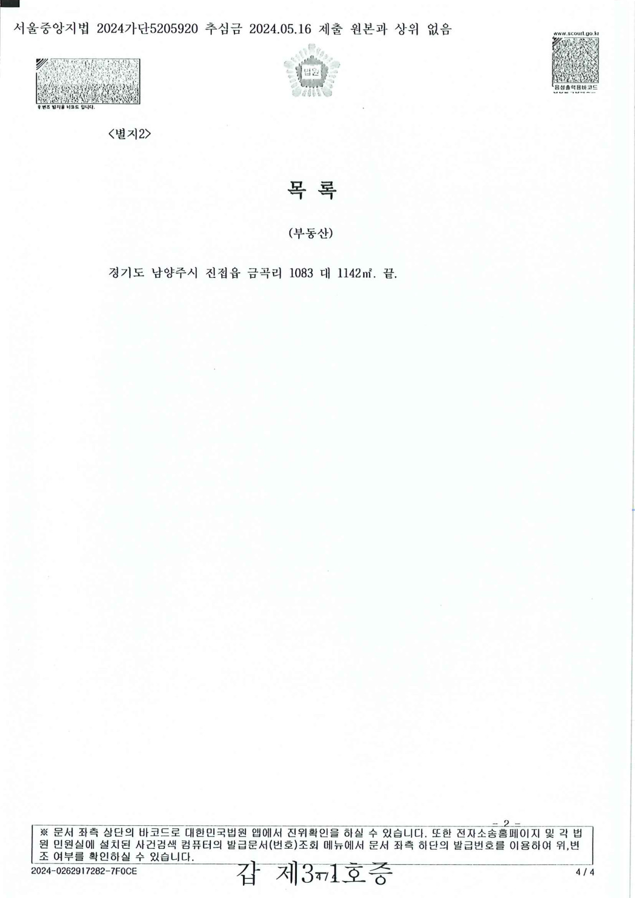

<details><summary>GW parser output</summary>

```markdown
<div style="text-align: center;"></div>


〈별지2〉

# 목록

(부동산)

경기도 남양주시 진접읍 금곡리 1083 대 1142m². 끝.
```
</details>

<details><summary>VL parser output</summary>

```markdown
# 서울중앙지법 2024가단5205920 추심금 2024.05.16 제출 원본과 상위 없음

## <별지2>

### 목 록

(부동산)

경기도 남양주시 진접읍 금곡리 1083 대 1142㎡. 끝.

---

※ 문서 좌측 상단의 바코드로 대한민국법원 앱에서 진위확인을 하실 수 있습니다. 또한 전자소송홈페이지 및 각 법원 민원실에 설치된 사건검색 컴퓨터의 발급문서 (번호) 조회 메뉴에서 문서 좌측 하단의 발급번호를 이용하여 위, 변조 여부를 확인하실 수 있습니다.

갑 제3471호증
```
</details>

## I37 · source index 37 · original p160

- current original-grounded analysis: **GW `RETRIEVAL_FAIL / CRITICAL_ERROR` · VL retry-01 `RETRIEVAL_FAIL / CRITICAL_ERROR / TRUNCATED` · winner `BOTH_FAIL` · `VL_BENEFICIAL=false`**
- comparison evidence: GW는 당사자 기호와 조항을 광범위하게 훼손. VL retry는 ⑤항 중간에서 절단되어 페이지 후반 누락.
- current v1: `accept_gw` — no hard-fail reason
- initial run metrics (history): GW 1184 chars / VL 0 chars · errors: GW `-'` / VL `empty'`; 현행 비교는 위 VL retry-01 판정과 아래 전문 사용
- VL empty retry-01: **1,093 chars · `RETRIEVAL_FAIL` · `VL_BENEFICIAL=false`** —
  제11조 문구 일부는 GW보다 크게 개선됐으나 ⑤항 중간에서 절단되어 페이지 후반을 누락.
  non-empty지만 최종 판정은 `BOTH_FAIL`.
  [retry output](retries/vl-empty-retry-01/normalized/I37_01_서울시_종로구_신문로_대리사무_분관신_서울중앙_부당이득금_주식회사_거삼_소장_pd_p160_vl.md) ·
  [raw](retries/vl-empty-retry-01/vl_raw/I37_01_서울시_종로구_신문로_대리사무_분관신_서울중앙_부당이득금_주식회사_거삼_소장_pd_p160.json)

- exact input: [`page_images/I37_01_서울시_종로구_신문로_대리사무_분관신_서울중앙_부당이득금_주식회사_거삼_소장_pd_p160.jpg`](page_images/I37_01_서울시_종로구_신문로_대리사무_분관신_서울중앙_부당이득금_주식회사_거삼_소장_pd_p160.jpg) · sha256 `980627f9a6135030c5339d62020071d7267701c73034603da561b253eb8c53b7`

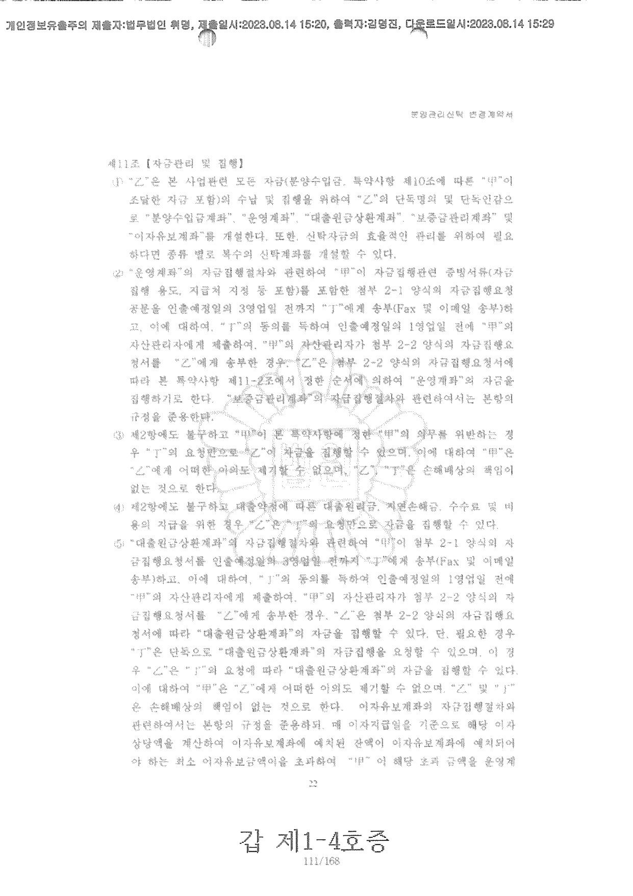

<details><summary>GW parser output</summary>

```markdown
개인정보유출주의 제출자:법무법인 휴명, 제출일시:2023.08.14 15:20, 출력자:김영진, 다운로드일시:2023.08.14 15:29

병원종리신뢰 병원통약세

제11조【자금관리 됨 접행】

(1) “2”은 본 사업편련 모든 자금(분양수입금, 특약사항 제10조에 따른 “1”이 조달한 자금 포함)의 수납 및 집행을 위하여 “2”의 단독명의 및 단독인감으로 “분양수입금계좌”, “운영계좌”, “대출원금상환계좌”, “보증금관리계좌” 및 “이자유보계좌”를 개설한다. 또한, 신학자금의 효율적인 관리를 위하여 필요하다면 종류 별로 복수의 신학계좌를 개설할 수 있다.

(2) “운영계좌”의 자금집행절차와 관련하여 “1”이 자금집행관련 중방서류(자금집행 용도, 지급처 지정 등 포함)를 포함한 첨부 2-1 양식의 자금집행요청공문을 인출예정일의 3영업일 전까지 “1”에게 송부(Fax 및 이해일 송부)하고, 이에 대하여, “1”의 동의를 득하여 인출예정일의 1영업일 전에 “1”의 자산관리자에게 제출하여, “1”의 자산관리자가 첨부 2-2 양식의 자금집행요청서를 “2”에게 송부한 정부, “2”은 첨부 2-2 양식의 자금집행요청서에 따라 본 특약사항 제11-2조에서 정한 순서에 의하여 “운영계좌”의 자금을 집행하기도 한다. “보증금관리계좌”의 자금집행절차와 관련하여서는 본항의 간정을 준용한다.

③ 제2항에도 불구하고 “11”이 본 폭약사항에 정한 “11”의 액무를 위반하는 경우 “1”의 요청만으로 “2”이 차급을 집행할 수 있으며, 이에 대하여 “11”은 “2”에게 어때한 이의로 제기할 수 없으며, “2” “11”은 손해배상의 책임이 없는 것으로 한다.

4) 제2항에도 불구하고 대출약점에 따른 대출원력금, 계열손해금, 수수료 및 비용의 자급을 위한 정부 “乙”은 “1”의 요청만으로, 자금을 집행할 수 있다.

5) “대출원금상환제과”의 자금집행결과와 관련하여 “11”이 첨부 2-1 양식의 자금집행요청서를 인출해집원화·3명압원·전까지 “2”에게 송부(Fax 및 이메일송부)하고, 이에 대하여, “1”의 동의를 독하여 인출예정일의 1명업원 전에 “11”의 자산관리자에게 제출하여, “11”의 자산관리자가 첨부 2-2 양식의 자금집행요청서를 “2”에게 송부한 경우, “2”은 첨부 2-2 양식의 자금집행요청서에 따라 “대출원금상환제과”의 자금을 집행할 수 있다. 단, 필요한 경우 “1”은 단독으로 “대출원금상환제과”의 자금집행을 요청할 수 있으며, 이 정부 “2”은 “1”의 요청에 따라 “대출원금상환제과”의 자금을 집행할 수 있다. 이에 대하여 “11”은 “2”에게 어떠한 이의도 제기할 수 없으며, “2” 및 “1”은 손해배상의 책임이 없는 것으로 한다. 이자유보계좌의 자금집행절차와 관련하여서는 본청의 규정을 준용하되, 매 이자지급일을 기준으로 해당 이자상당액을 계산하여 이자유보계좌에 예치된 잔액이 이자유보계좌에 예치되어야 하는 최소 이자유보금액이를 초과하여 “11”이 해당 초과 금액을 운영계

갑 제1-4호증

111/168
```
</details>

<details><summary>VL parser output — retry-01 (current reviewed output)</summary>

```markdown
## 분양관리신탁 변경계약서

#### 제11조【자금관리 및 집행】
① “乙”은 본 사업관련 모든 자금 (분양수입금, 특약사항 제10조에 따른 “甲”이 조달한 자금 포함) 의 수납 및 집행을 위하여 “乙”의 단독명의 및 단독인감으로 “분양수입금계좌”, “운영계좌”, “대출원금상환계좌”, “보증금관리계좌” 및 “이자유보계좌”를 개설한다. 또한, 신탁자금의 효율적인 관리를 위하여 필요하면 종류 별로 복수의 신탁계좌를 개설할 수 있다.
② “운영계좌”의 자금집행절차와 관련하여 “甲”이 자금집행관련 증빙서류 (자금집행 용도, 지급처 지정 등 포함) 를 포함한 첨부 2-1 양식의 자금집행요청공문을 인출예정일의 3영업일 전까지 “丁”에게 송부 (Fax 및 이메일 송부) 하고, 이에 대하여, “丁”의 동의를 득하여 인출예정일의 1영업일 전에 “甲”의 자산관리자에게 제출하여, “甲”의 자산관리자가 첨부 2-2 양식의 자금집행요청서를 “乙”에게 송부한 경우, “乙”은 첨부 2-2 양식의 자금집행요청서에 따라 본 특약사항 제11-2조에서 정한 순서에 의하여 “운영계좌”의 자금을 집행하기로 한다. “보증금관리계좌”의 자금집행절차와 관련해서는 본항의 규정을 준용한다.
③ 제2항에도 불구하고 “甲”이 본 특약사항에 정한 “甲”의 의무를 위반하는 경우 “丁”의 요청만으로 “乙”이 자금을 집행할 수 있으며, 이에 대하여 “甲”은 “乙”에게 어떠한 이의도 제기할 수 없으며, “乙”, “丁”은 손해배상의 책임이 없는 것으로 한다.
④ 제2항에도 불구하고 대출약정에 따른 대출원리금, 지연손해금, 수수료 및 비용의 지급을 위한 경우 “乙”은 “丁”의 요청만으로 자금을 집행할 수 있다.
⑤ “대출원금상환계좌”의 자금집행절차와 관련하여 “甲”이 첨부 2-1 양식의 자금집행요청서를 인출예정일의 3영업일 전까지 “丁”에게 송부 (Fax 및 이메일 송부) 하고, 이에 대하여, “丁”의 동의를 득하여 인출예정일의 1영업일 전에 “甲”의 자산관리자에게 제출하여, “甲”의 자산관리자가 첨부 2-2 양식의 자금집행요청서를 “乙”에게 송부한 경우, “乙”은 첨부 2-2 양식의 자금집행요청서에 따라 “대출원금상환계좌”의 자금을 집행할 수 있다. 단, 필요한 경우 “丁”은 단독으로 “대출원금상환계좌”의 자금집행을 요청할 수 있으며, 이 경우 “乙”은 “丁”의 요청에 따라 “대출원금상환계좌”의 자금을 집행할 수 있다. 이에 대하여 “甲”은 “乙”에게 어떠한 이의도 제기할 수 없으며, “乙” 및 “丁”은 손해배상의 책임이 없는 것으로 한다. 이자유보계좌의 자금집행절차와 관련해서는 본항의 규정을 준용하되, 매 이자지급일을 기준으로 해당 이자상당액을 계산하여 이자유보계좌에 예치된 잔액이 이자유보계좌에 예치되어야 하는 최소 이자유보금액이를 초과하여 “甲”이 해당 초과 금액을 운영계

갑 제1-4호증
```
</details>

## I41 · source index 41 · original p10

- current original-grounded analysis: **GW `RETRIEVAL_PASS / CRITICAL_ERROR` · VL `RETRIEVAL_PASS / CRITICAL_ERROR` · winner `TIE` · `VL_BENEFICIAL=false`**
- comparison evidence: 원본 `테스타디앤씨`를 양쪽 모두 `테스타디엔씨`로 변경. 금액은 모두 보존.
- current v1: `accept_gw` — no hard-fail reason
- chars: GW 434 / VL 475 · errors: GW `-'` / VL `-'`
- exact input: [`page_images/I41_01_하남미사지구_지식산언센터_관토신_서울중앙_하자보수비등_미사테스타타워관리단_소장_p_p10.jpg`](page_images/I41_01_하남미사지구_지식산언센터_관토신_서울중앙_하자보수비등_미사테스타타워관리단_소장_p_p10.jpg) · sha256 `e5092a5bebeada5832009ab8e20a436d6ad18b8c3ef583ebeaddaacf305c2af0`

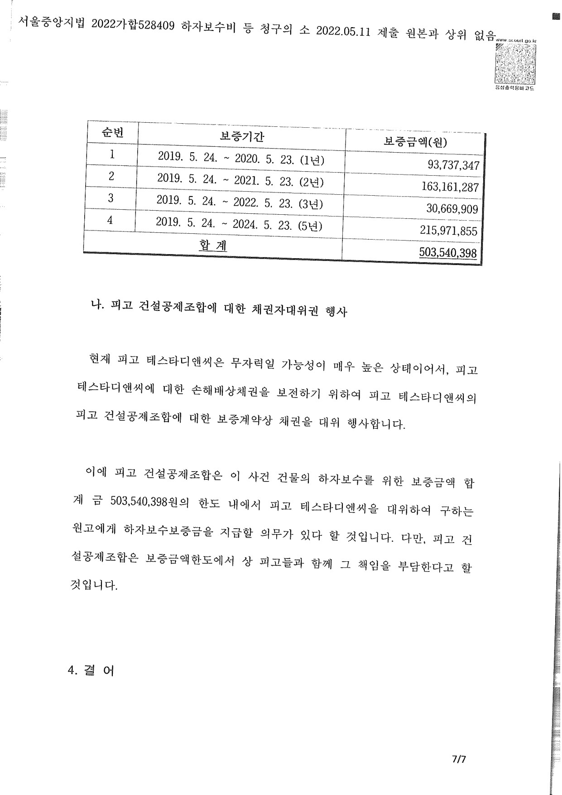

<details><summary>GW parser output</summary>

```markdown
<div style="text-align: center;"></div>


<div style="text-align: center;">융성충적용비코드</div>


<table border=1 style='margin: auto; word-wrap: break-word;'><tr><td style='text-align: center; word-wrap: break-word;'>순번</td><td style='text-align: center; word-wrap: break-word;'>보증기간</td><td style='text-align: center; word-wrap: break-word;'>보증금액(원)</td></tr><tr><td style='text-align: center; word-wrap: break-word;'>1</td><td style='text-align: center; word-wrap: break-word;'>2019. 5. 24. ~ 2020. 5. 23. (1년)</td><td style='text-align: center; word-wrap: break-word;'>93,737,347</td></tr><tr><td style='text-align: center; word-wrap: break-word;'>2</td><td style='text-align: center; word-wrap: break-word;'>2019. 5. 24. ~ 2021. 5. 23. (2년)</td><td style='text-align: center; word-wrap: break-word;'>163,161,287</td></tr><tr><td style='text-align: center; word-wrap: break-word;'>3</td><td style='text-align: center; word-wrap: break-word;'>2019. 5. 24. ~ 2022. 5. 23. (3년)</td><td style='text-align: center; word-wrap: break-word;'>30,669,909</td></tr><tr><td style='text-align: center; word-wrap: break-word;'>4</td><td style='text-align: center; word-wrap: break-word;'>2019. 5. 24. ~ 2024. 5. 23. (5년)</td><td style='text-align: center; word-wrap: break-word;'>215,971,855</td></tr><tr><td colspan="2">합계</td><td style='text-align: center; word-wrap: break-word;'>503,540,398</td></tr></table>

### 나. 피고 건설공제조합에 대한 채권자대위권 행사

현재 피고 테스타디앤씨은 무자력일 가능성이 매우 높은 상태이어서, 피고 테스타디앤씨에 대한 손해배상채권을 보전하기 위하여 피고 테스타디앤씨의 피고 건설공제조합에 대한 보증계약상 채권을 대위 행사합니다.

이에 피고 건설공제조합은 이 사건 건물의 하자보수를 위한 보증금액 합계 금 503,540,398원의 한도 내에서 피고 테스타디엔씨를 대위하여 구하는 원고에게 하자보수보증금을 지급할 의무가 있다 할 것입니다. 다만, 피고 건설공제조합은 보증금액한도에서 상 피고들과 함께 그 책임을 부담한다고 할 것입니다.

### 4. 결 어
```
</details>

<details><summary>VL parser output</summary>

```markdown
<table><thead><tr><th>순번</th><th>보증기간</th><th>보증금액(원)</th></tr></thead><tbody><tr><td>1</td><td>2019. 5. 24. ~ 2020. 5. 23. (1년)</td><td>93,737,347</td></tr><tr><td>2</td><td>2019. 5. 24. ~ 2021. 5. 23. (2년)</td><td>163,161,287</td></tr><tr><td>3</td><td>2019. 5. 24. ~ 2022. 5. 23. (3년)</td><td>30,669,909</td></tr><tr><td>4</td><td>2019. 5. 24. ~ 2024. 5. 23. (5년)</td><td>215,971,855</td></tr><tr><td colspan="2">합 계</td><td>503,540,398</td></tr></tbody></table>

서울중앙지법 2022가합528409 하자보수비 등 청구의 소 2022.05.11 제출 원본과 상위 없음

#### 나. 피고 건설공제조합에 대한 채권자대위권 행사

현재 피고 테스타디엔씨는 무자력일 가능성이 매우 높은 상태이어서, 피고 테스타디엔씨에 대한 손해배상채권을 보전하기 위하여 피고 테스타디엔씨의 피고 건설공제조합에 대한 보증계약상 채권을 대위 행사합니다.

이에 피고 건설공제조합은 이 사건 건물의 하자보수를 위한 보증금액 합계 금 503,540,398원의 한도 내에서 피고 테스타디엔씨을 대위하여 구하는 원고에게 하자보수보증금을 지급할 의무가 있다 할 것입니다. 다만, 피고 건설공제조합은 보증금액한도에서 상 피고들과 함께 그 책임을 부담한다고 할 것입니다.

#### 4. 결 어
```
</details>

## I42 · source index 42 · original p336

- current original-grounded analysis: **GW `RETRIEVAL_PASS / CRITICAL_ERROR / PARTIAL` · VL `RETRIEVAL_PASS / CRITICAL_ERROR` · winner `VL` · `VL_BENEFICIAL=false`**
- comparison evidence: GW는 수취인 주소를 절단; VL은 더 완전하지만 원본 `용죽1로`를 `용죽로`로 변경해 critical address error가 남음.
- current v1: `accept_gw` — no hard-fail reason
- chars: GW 660 / VL 684 · errors: GW `-'` / VL `-'`
- exact input: [`page_images/I42_01_평택시_용이동_관토신_하자보수에갈음하는손해배상등_평택비전지웰푸르지오입주자대표회의__p336.jpg`](page_images/I42_01_평택시_용이동_관토신_하자보수에갈음하는손해배상등_평택비전지웰푸르지오입주자대표회의__p336.jpg) · sha256 `a6352a5751e9fce4b2827a791e40fbd99dd17ba0e982f928362aca94b1fb353b`

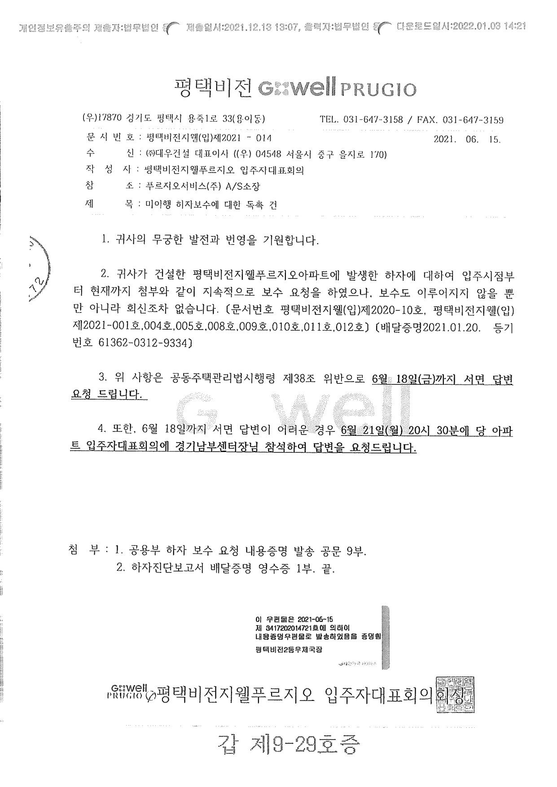

<details><summary>GW parser output</summary>

```markdown
# 평택비전 G:well PRUGIO

(우)17870 경기도 평택시 용죽1로 33(용이동)

TEL. 031-647-3158 / FAX. 031-647-3159


문서 번호 : 평택비전지웰(입)제2021-014

2021. 06. 15.

수 신 : (주)대우건설 대표이사 ((우) 04548 서울시 중구 을)

작 성 자 : 평택비전지월푸르지오 입주지대표회의

참 소 : 푸르지오서비스(주) A/S소장

제목: 미이행 히자보수에 대한 독촉 건

1. 귀사의 무궁한 발전과 번영을 기원합니다.

2. 귀사가 건설한 평택비전지웰푸르지오아파트에 발생한 하자에 대하여 입주시점부터 현재까지 첨부와 같이 지속적으로 보수 요청을 하였으나, 보수도 이루어지지 않을 뿐만 아니라 회신조차 없습니다. (문서번호 평택비전지웰(입)제2020-10호, 평택비전지웰(입)제2021-001호, 004호, 005호, 008호, 009호, 010호, 011호, 012호) (배달증명2021.01.20. 등기번호 61362-0312-9334)

3. 위 사항은 공동주택관리법시행령 제38조 위반으로 6월 18일(금)까지 서면 답변 요청 드립니다.

<div style="text-align: center;"></div>


4. 또한, 6월 18일까지 서면 답변이 어려운 경우 6월 21일(월) 20시 30분에 당 아파트 입주자대표회의에 경기남부센터장님 참석하여 답변을 요청드립니다.

첨부: 1. 공용부 하자 보수 요청 내용증명 발송 공문 9부.

2. 하자진단보고서 배달증명 영수증 1부. 끝.

이 우편물은 2021-06-15

제 3417202014721호에 의하여

내용중염우편물로 발송하였음을 중명함

평택비전2등우체국장

prugio평택비전지웰푸르지오입주자대표회의
```
</details>

<details><summary>VL parser output</summary>

```markdown
# 평택비전 G-well PRUGIO

**(우)17870 경기도 평택시 용죽로 33(용이동)**

**TEL. 031-647-3158 / FAX. 031-647-3159**

문서번호 : 평택비전지웰(입)제2021 - 014

2021. 06. 15.

수 신 : ㈜대우건설 대표이사 ((우) 04548 서울시 중구 을지로 170)

작 성 자 : 평택비전지웰푸르지오 입주자대표회의

참 조 : 푸르지오서비스(주) A/S소장

제 목 : 미이행 하자보수에 대한 독촉 건


1. 귀사의 무궁한 발전과 번영을 기원합니다.

2. 귀사가 건설한 평택비전지웰푸르지오아파트에 발생한 하자에 대하여 입주시점부터 현재까지 첨부와 같이 지속적으로 보수 요청을 하였으나, 보수도 이루어지지 않을 뿐만 아니라 회신조차 없습니다. (문서번호 평택비전지웰(입)제2020-10호, 평택비전지웰(입)제2021-001호,004호,005호,008호,009호,010호,011호,012호) (배달증명2021.01.20. 등기번호 61362-0312-9334)

3. 위 사항은 공동주택관리법시행령 제38조 위반으로 6월 18일(금)까지 서면 답변 요청 드립니다.

4. 또한, 6월 18일까지 서면 답변이 어려운 경우 6월 21일(월) 20시 30분에 당 아파트 입주자대표회의에 경기남부센터장님 참석하여 답변을 요청드립니다.

첨 부 : 1. 공용부 하자 보수 요청 내용증명 발송 공문 9부.

2. 하자진단보고서 배달증명 영수증 1부. 끝.


이 우편물은 2021-06-15
제 3417202014721호에 의하여
내용증명우편물로 발송하였음을 증명함
평택비전2동우체국장


G-well PRUGIO 평택비전지웰푸르지오 입주자대표회의

갑 제9-29호증
```
</details>

## I46 · source index 46 · original p65

- current original-grounded analysis: **GW `RETRIEVAL_BORDERLINE / CRITICAL_ERROR` · VL retry-01 `RETRIEVAL_PASS / NO_MATERIAL_ERROR` · winner `VL` · `VL_BENEFICIAL=true`**
- comparison evidence: 원본 원고 `손세라`; GW `순세라`; VL retry는 `손세라`와 보이는 날짜·금액을 보존.
- current v1: `accept_gw` — no hard-fail reason
- initial run metrics (history): GW 500 chars / VL 0 chars · errors: GW `-'` / VL `empty'`; 현행 비교는 위 VL retry-01 판정과 아래 전문 사용
- VL empty retry-01: **1,591 chars · `RETRIEVAL_PASS` · `VL_BENEFICIAL=true`** —
  원고 `손세라`와 표의 날짜·금액을 보존해 GW의 `순세라` identity error를 복구.
  [retry output](retries/vl-empty-retry-01/normalized/I46_01_동탄2신도시_관토신_서울중앙_분양대금반환_김은현외17_소장_pdf_p65_vl.md) ·
  [raw](retries/vl-empty-retry-01/vl_raw/I46_01_동탄2신도시_관토신_서울중앙_분양대금반환_김은현외17_소장_pdf_p65.json)

- exact input: [`page_images/I46_01_동탄2신도시_관토신_서울중앙_분양대금반환_김은현외17_소장_pdf_p65.jpg`](page_images/I46_01_동탄2신도시_관토신_서울중앙_분양대금반환_김은현외17_소장_pdf_p65.jpg) · sha256 `88a22043023a1edb4ea6300a4dba6d781e85b99f96fa1459f86de30049df16d8`

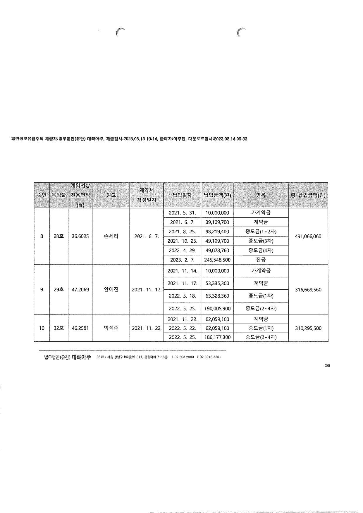

<details><summary>GW parser output</summary>

```markdown

<table border=1 style='margin: auto; word-wrap: break-word;'><tr><td style='text-align: center; word-wrap: break-word;'>순번</td><td style='text-align: center; word-wrap: break-word;'>목적물</td><td style='text-align: center; word-wrap: break-word;'>계약서상진용편적( $ m^{{2}} $)</td><td style='text-align: center; word-wrap: break-word;'>원고</td><td style='text-align: center; word-wrap: break-word;'>계약서작성일자</td><td style='text-align: center; word-wrap: break-word;'>납입일자</td><td style='text-align: center; word-wrap: break-word;'>납입금액(원)</td><td style='text-align: center; word-wrap: break-word;'>명목</td><td style='text-align: center; word-wrap: break-word;'>총 납입금액(원)</td></tr><tr><td rowspan="6">8</td><td rowspan="6">28호</td><td rowspan="6">36.6025</td><td rowspan="6">순세라</td><td rowspan="6">2021. 6. 7.</td><td style='text-align: center; word-wrap: break-word;'>2021. 5. 31.</td><td style='text-align: center; word-wrap: break-word;'>10,000,000</td><td style='text-align: center; word-wrap: break-word;'>가계약금</td><td rowspan="6">491,066,060</td></tr><tr><td style='text-align: center; word-wrap: break-word;'>2021. 6. 7.</td><td style='text-align: center; word-wrap: break-word;'>39,109,700</td><td style='text-align: center; word-wrap: break-word;'>계약금</td></tr><tr><td style='text-align: center; word-wrap: break-word;'>2021. 8. 25.</td><td style='text-align: center; word-wrap: break-word;'>98,219,400</td><td style='text-align: center; word-wrap: break-word;'>중도금(1~2차)</td></tr><tr><td style='text-align: center; word-wrap: break-word;'>2021. 10. 25.</td><td style='text-align: center; word-wrap: break-word;'>49,109,700</td><td style='text-align: center; word-wrap: break-word;'>중도금(3차)</td></tr><tr><td style='text-align: center; word-wrap: break-word;'>2022. 4. 29.</td><td style='text-align: center; word-wrap: break-word;'>49,078,760</td><td style='text-align: center; word-wrap: break-word;'>중도금(4차)</td></tr><tr><td style='text-align: center; word-wrap: break-word;'>2023. 2. 7.</td><td style='text-align: center; word-wrap: break-word;'>245,548,500</td><td style='text-align: center; word-wrap: break-word;'>잔금</td></tr><tr><td rowspan="4">9</td><td rowspan="4">29호</td><td rowspan="4">47.2069</td><td rowspan="4">안예진</td><td rowspan="4">2021. 11. 17.</td><td style='text-align: center; word-wrap: break-word;'>2021. 11. 14.</td><td style='text-align: center; word-wrap: break-word;'>10,000,000</td><td style='text-align: center; word-wrap: break-word;'>가계약금</td><td rowspan="4">316,669,560</td></tr><tr><td style='text-align: center; word-wrap: break-word;'>2021. 11. 17.</td><td style='text-align: center; word-wrap: break-word;'>53,335,300</td><td style='text-align: center; word-wrap: break-word;'>계약금</td></tr><tr><td style='text-align: center; word-wrap: break-word;'>2022. 5. 18.</td><td style='text-align: center; word-wrap: break-word;'>63,328,360</td><td style='text-align: center; word-wrap: break-word;'>중도금(1차)</td></tr><tr><td style='text-align: center; word-wrap: break-word;'>2022. 5. 25.</td><td style='text-align: center; word-wrap: break-word;'>190,005,900</td><td style='text-align: center; word-wrap: break-word;'>중도금(2~4차)</td></tr><tr><td rowspan="3">10</td><td rowspan="3">32호</td><td rowspan="3">46.2581</td><td rowspan="3">박석준</td><td rowspan="3">2021. 11. 22.</td><td style='text-align: center; word-wrap: break-word;'>2021. 11. 22.</td><td style='text-align: center; word-wrap: break-word;'>62,059,100</td><td style='text-align: center; word-wrap: break-word;'>계약금</td><td rowspan="3">310,295,500</td></tr><tr><td style='text-align: center; word-wrap: break-word;'>2022. 5. 22.</td><td style='text-align: center; word-wrap: break-word;'>62,059,100</td><td style='text-align: center; word-wrap: break-word;'>중도금(1차)</td></tr><tr><td style='text-align: center; word-wrap: break-word;'>2022. 5. 25.</td><td style='text-align: center; word-wrap: break-word;'>186,177,300</td><td style='text-align: center; word-wrap: break-word;'>중도금(2~4차)</td></tr></table>
```
</details>

<details><summary>VL parser output — retry-01 (current reviewed output)</summary>

```markdown
개인정보유출주의 제출자:법무법인(유한) 대륙아주, 제출일시:2023.03.13 19:14, 출력자:이주현, 다운로드일시:2023.03.14 09:33

<table><thead><tr><th>순번</th><th>목적물</th><th>계약서상 전용면적 (㎡)</th><th>원고</th><th>계약서 작성일자</th><th>납입일자</th><th>납입금액(원)</th><th>명목</th><th>총 납입금액(원)</th></tr></thead><tbody><tr><td rowspan="6">8</td><td rowspan="6">28호</td><td rowspan="6">36.6025</td><td rowspan="6">손세라</td><td rowspan="6">2021. 6. 7.</td><td>2021. 5. 31.</td><td>10,000,000</td><td>가계약금</td><td rowspan="6">491,066,060</td></tr><tr><td>2021. 6. 7.</td><td>39,109,700</td><td>계약금</td></tr><tr><td>2021. 8. 25.</td><td>98,219,400</td><td>중도금(1~2차)</td></tr><tr><td>2021. 10. 25.</td><td>49,109,700</td><td>중도금(3차)</td></tr><tr><td>2022. 4. 29.</td><td>49,078,760</td><td>중도금(4차)</td></tr><tr><td>2023. 2. 7.</td><td>245,548,500</td><td>잔금</td></tr><tr><td rowspan="4">9</td><td rowspan="4">29호</td><td rowspan="4">47.2069</td><td rowspan="4">안예진</td><td rowspan="4">2021. 11. 17.</td><td>2021. 11. 14.</td><td>10,000,000</td><td>가계약금</td><td rowspan="4">316,669,560</td></tr><tr><td>2021. 11. 17.</td><td>53,335,300</td><td>계약금</td></tr><tr><td>2022. 5. 18.</td><td>63,328,360</td><td>중도금(1차)</td></tr><tr><td>2022. 5. 25.</td><td>190,005,900</td><td>중도금(2~4차)</td></tr><tr><td rowspan="3">10</td><td rowspan="3">32호</td><td rowspan="3">46.2581</td><td rowspan="3">박석준</td><td rowspan="3">2021. 11. 22.</td><td>2021. 11. 22.</td><td>62,059,100</td><td>계약금</td><td rowspan="3">310,295,500</td></tr><tr><td>2022. 5. 22.</td><td>62,059,100</td><td>중도금(1차)</td></tr><tr><td>2022. 5. 25.</td><td>186,177,300</td><td>중도금(2~4차)</td></tr></tbody></table>

법무법인(유한) 대륙아주 06151 서울 강남구 테헤란로 317, 정동타워 7~16층 T 02 563 2900 F 02 3016 5201
```
</details>

## I49 · source index 49 · original p4

- current original-grounded analysis: **GW `RETRIEVAL_PASS / MINOR_ERROR` · VL `RETRIEVAL_FAIL / CRITICAL_ERROR / TRUNCATED` · winner `GW` · `VL_BENEFICIAL=false`**
- comparison evidence: GW는 `2023.6.30/2023.12.30`과 사건번호를 보존; VL은 첫 문장에서 절단.
- current v1: `accept_gw` — no hard-fail reason
- chars: GW 742 / VL 82 · errors: GW `-'` / VL `-'`
- exact input: [`page_images/I49_05_안산시_성곡동_관토신_책준_안산지원_매매대금반환_박신숙_판결문_pdf_p4.jpg`](page_images/I49_05_안산시_성곡동_관토신_책준_안산지원_매매대금반환_박신숙_판결문_pdf_p4.jpg) · sha256 `19f71e068bb455215ec1bde78810c45b0b07676efeefb749135a0e93ac10152b`

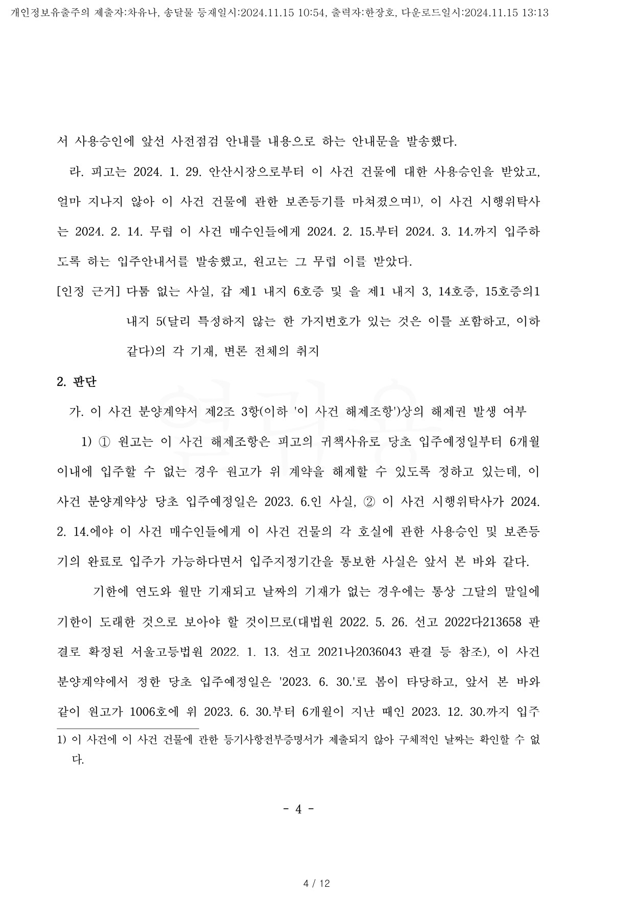

<details><summary>GW parser output</summary>

```markdown
서 사용승인에 앞선 사전점검 안내를 내용으로 하는 안내문을 발송했다.

라. 피고는 2024. 1. 29. 안산시장으로부터 이 사건 건물에 대한 사용승인을 받았고,

얼마 지나지 않아 이 사건 건물에 관한 보존등기를 마쳐졌으며1), 이 사건 시행위탁사

는 2024. 2. 14. 무렵 이 사건 매수인들에게 2024. 2. 15.부터 2024. 3. 14.까지 입주하

도록 하는 입주안내서를 발송했고, 원고는 그 무렵 이를 받았다.

[거] 다툼 없는 사실, 갑 제1 내지 6호증 및 을 제1 내지 3, 14호증, 15호증의1

내지 5(달리 특성하지 않는 한 가지번호가 있는 것은 이를 포함하고, 이하

같다)의 각 기재, 변론 전체의 취지

### 2. 판단

가. 이 사건 분양계약서 제2조 3항(이하 '이 사건 해제조항')상의 해제권 발생 여부

1) ① 원고는 이 사건 해제조항은 피고의 귀책사유로 당초 입주예정일부터 6개월 이내에 입주할 수 없는 경우 원고가 위 계약을 해제할 수 있도록 정하고 있는데, 이 사건 분양계약상 당초 입주예정일은 2023. 6.인 사실, ② 이 사건 시행위탁사가 2024. 2. 14.에야 이 사건 매수인들에게 이 사건 건물의 각 호실에 관한 사용승인 및 보존등기의 완료로 입주가 가능하다면서 입주지정기간을 통보한 사실은 앞서 본 바와 같다.

기한에 연도와 월만 기재되고 날짜의 기재가 없는 경우에는 통상 그달의 말일에 기한이 도래한 것으로 보아야 할 것이므로(대법원 2022. 5. 26. 선고 2022다213658 판결로 확정된 서울고등법원 2022. 1. 13. 선고 2021나2036043 판결 등 참조), 이 사건 분양계약에서 정한 당초 입주예정일은 '2023. 6. 30.'로 봄이 타당하고, 앞서 본 바와 같이 원고가 1006호에 위 2023. 6. 30.부터 6개월이 지난 때인 2023. 12. 30.까지 입주 1) 이 사건에 이 사건 건물에 관한 등기사항전부증명서가 제출되지 않아 구체적인 날짜는 확인할 수 없다.
```
</details>

<details><summary>VL parser output</summary>

```markdown
{
  "elements": [
    {
      "category": "figure",
      "content": {
        "html": "",
        "markdown": "서 사용승인에 앞선 사전점검 안내를
```
</details>

## I56 · source index 56 · original p44

- current original-grounded analysis: **GW `RETRIEVAL_BORDERLINE / CRITICAL_ERROR` · VL `RETRIEVAL_BORDERLINE / CRITICAL_ERROR / HALLUCINATION_CONFIRMED` · winner `BOTH_FAIL` · `VL_BENEFICIAL=false`**
- comparison evidence: 양쪽 모두 당사자명·주소를 훼손하고, VL은 등록번호 숫자를 생성/혼합하며 대표자를 변경. 금액만 보존.
- current v1: `accept_gw` — no hard-fail reason
- chars: GW 2124 / VL 1794 · errors: GW `-'` / VL `-'`
- exact input: [`page_images/I56_01_고양시_향동동_관토신_서울중앙_분양대금반환_등_이동배_외4_소장_pdf_p44.jpg`](page_images/I56_01_고양시_향동동_관토신_서울중앙_분양대금반환_등_이동배_외4_소장_pdf_p44.jpg) · sha256 `2a507c5c3c473a2c71670d720e5456332256c59d00661b96ef433d4a5380ac3c`

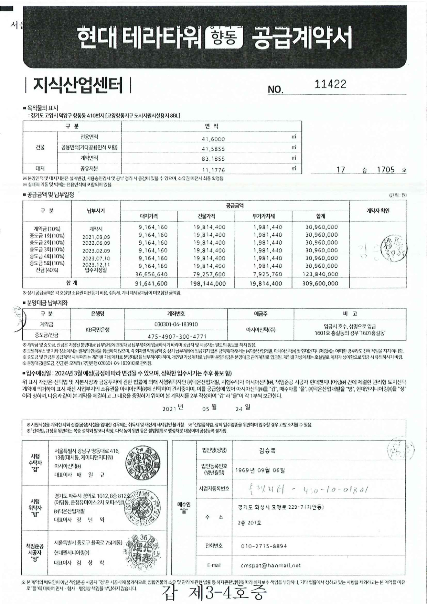

<details><summary>GW parser output</summary>

```markdown
# 현대 테라타워 향동 공급계약서

## 지식산업센터

NO. 11422

목적물의 표시

:경기도 고양시 덕양구 항동동 410번지 [고양항동지구 도시지원시설용지 8BL]


<table border=1 style='margin: auto; word-wrap: break-word;'><tr><td colspan="2">구 분</td><td style='text-align: center; word-wrap: break-word;'>면 적</td></tr><tr><td rowspan="3">건물</td><td style='text-align: center; word-wrap: break-word;'>전용면적</td><td style='text-align: center; word-wrap: break-word;'>41,6000  $ m^{{2}} $</td></tr><tr><td style='text-align: center; word-wrap: break-word;'>공용면석(기타공용면석 포함)</td><td style='text-align: center; word-wrap: break-word;'>41,5855  $ m^{{2}} $</td></tr><tr><td style='text-align: center; word-wrap: break-word;'>계약면적</td><td style='text-align: center; word-wrap: break-word;'>83,1855  $ m^{{2}} $</td></tr><tr><td style='text-align: center; word-wrap: break-word;'>대지</td><td style='text-align: center; word-wrap: break-word;'>공유지분</td><td style='text-align: center; word-wrap: break-word;'>11,1776  $ m^{{2}} $</td></tr></table>

※분양면적 및 대지지분은 설계변경, 사용승인감사 및 공부 정리 시 증감이 있을 수 있으며, 소유권 이전시 최종 확정됨

 $ \underline{17} $  $ \underline{冬} $  $ \underline{1705} $  $ \underline{立} $

※실내의 기동 및 벽체는 선용면적에 포함되어 있음

## ㅣ 공급금액 및 납부일정

(단위: 원)


<table border=1 style='margin: auto; word-wrap: break-word;'><tr><td rowspan="2">구 분</td><td rowspan="2">납부시기</td><td colspan="4">공급금액</td><td rowspan="2">계약자 확인</td></tr><tr><td style='text-align: center; word-wrap: break-word;'>대자격</td><td style='text-align: center; word-wrap: break-word;'>건물가격</td><td style='text-align: center; word-wrap: break-word;'>부가가치세</td><td style='text-align: center; word-wrap: break-word;'>합계</td></tr><tr><td style='text-align: center; word-wrap: break-word;'>계약금 (10%)</td><td style='text-align: center; word-wrap: break-word;'>계약시</td><td style='text-align: center; word-wrap: break-word;'>9,164,160</td><td style='text-align: center; word-wrap: break-word;'>19,814,400</td><td style='text-align: center; word-wrap: break-word;'>1,981,440</td><td style='text-align: center; word-wrap: break-word;'>30,960,000</td><td style='text-align: center; word-wrap: break-word;'></td></tr><tr><td style='text-align: center; word-wrap: break-word;'>중도금 1회 (10%)</td><td style='text-align: center; word-wrap: break-word;'>2021.09.09</td><td style='text-align: center; word-wrap: break-word;'>9,164,160</td><td style='text-align: center; word-wrap: break-word;'>19,814,400</td><td style='text-align: center; word-wrap: break-word;'>1,981,440</td><td style='text-align: center; word-wrap: break-word;'>30,960,000</td><td style='text-align: center; word-wrap: break-word;'></td></tr><tr><td style='text-align: center; word-wrap: break-word;'>중도금 2회 (10%)</td><td style='text-align: center; word-wrap: break-word;'>2022.06.09</td><td style='text-align: center; word-wrap: break-word;'>9,164,160</td><td style='text-align: center; word-wrap: break-word;'>19,814,400</td><td style='text-align: center; word-wrap: break-word;'>1,981,440</td><td style='text-align: center; word-wrap: break-word;'>30,960,000</td><td style='text-align: center; word-wrap: break-word;'></td></tr><tr><td style='text-align: center; word-wrap: break-word;'>중도금 3회 (10%)</td><td style='text-align: center; word-wrap: break-word;'>2023.02.09</td><td style='text-align: center; word-wrap: break-word;'>9,164,160</td><td style='text-align: center; word-wrap: break-word;'>19,814,400</td><td style='text-align: center; word-wrap: break-word;'>1,981,440</td><td style='text-align: center; word-wrap: break-word;'>30,960,000</td><td style='text-align: center; word-wrap: break-word;'></td></tr><tr><td style='text-align: center; word-wrap: break-word;'>중도금 4회 (10%)</td><td style='text-align: center; word-wrap: break-word;'>2023.07.10</td><td style='text-align: center; word-wrap: break-word;'>9,164,160</td><td style='text-align: center; word-wrap: break-word;'>19,814,400</td><td style='text-align: center; word-wrap: break-word;'>1,981,440</td><td style='text-align: center; word-wrap: break-word;'>30,960,000</td><td style='text-align: center; word-wrap: break-word;'></td></tr><tr><td style='text-align: center; word-wrap: break-word;'>중도금 5회 (10%)</td><td style='text-align: center; word-wrap: break-word;'>2023.12.11</td><td style='text-align: center; word-wrap: break-word;'>9,164,160</td><td style='text-align: center; word-wrap: break-word;'>19,814,400</td><td style='text-align: center; word-wrap: break-word;'>1,981,440</td><td style='text-align: center; word-wrap: break-word;'>30,960,000</td><td style='text-align: center; word-wrap: break-word;'></td></tr><tr><td style='text-align: center; word-wrap: break-word;'>찬금 (40%)</td><td style='text-align: center; word-wrap: break-word;'>업주지정일</td><td style='text-align: center; word-wrap: break-word;'>36,656,640</td><td style='text-align: center; word-wrap: break-word;'>79,257,600</td><td style='text-align: center; word-wrap: break-word;'>7,925,760</td><td style='text-align: center; word-wrap: break-word;'>123,840,000</td><td style='text-align: center; word-wrap: break-word;'></td></tr><tr><td colspan="2">합 계</td><td style='text-align: center; word-wrap: break-word;'>91,641,600</td><td style='text-align: center; word-wrap: break-word;'>198,144,000</td><td style='text-align: center; word-wrap: break-word;'>19,814,400</td><td style='text-align: center; word-wrap: break-word;'>309,600,000</td><td style='text-align: center; word-wrap: break-word;'></td></tr></table>

<div style="text-align: center;"></div>


※상기공급금액은각호실별소유권이전등기비용,취득세,가티제세공과금이미포함된금액임

## ·분양대금 납부계좌


<table border=1 style='margin: auto; word-wrap: break-word;'><tr><td style='text-align: center; word-wrap: break-word;'>구 분</td><td style='text-align: center; word-wrap: break-word;'>은행명</td><td style='text-align: center; word-wrap: break-word;'>계좌번호</td><td style='text-align: center; word-wrap: break-word;'>예금주</td><td style='text-align: center; word-wrap: break-word;'>비 고</td></tr><tr><td style='text-align: center; word-wrap: break-word;'>계약금</td><td rowspan="2">KB국민은행</td><td style='text-align: center; word-wrap: break-word;'>030301-04-183910</td><td rowspan="2">아시아신탁(주)</td><td rowspan="2">입금시 호수, 성명으로 입금\n1601호 홍길동의 강우 &#x27;1601홍길동&#x27;</td></tr><tr><td style='text-align: center; word-wrap: break-word;'>중도금/전금</td><td style='text-align: center; word-wrap: break-word;'>475-4907-300-4771</td></tr></table>

※계약금 및 중도금, 잔금은 지정된 분양대금 납부일정에 분양대금 납부계좌에 입금하시기 바라며 공급자 및 시공자는 별도의 통보를 하지 않음.

※ 모델하우스 및 기타 장소에서는 일체의 현금을 취급하지 않으며, 각 회차별 익정금액 중 싱가답부계좌에 입금되기 않은 금액에 대해서는 (위탁은산업개발, 마시아산돼액) 및 현대전지니어링숙하는 어떠한 경우라도 전혀 적임을 지지 아니함.

※ 중도금 및 진금은 공급계약 시 부여되는 개인별 가상계좌로 분양대금을 납부하여야 하며, 개인별 가상계좌로 납부한 분양대금은 분양대금 관리계좌로 입금됨. 개인별 가상계좌는 호실별로 계좌가 상이함으로 입금시 유의하시기 바람.

※ 분양대금(중도금, 전금)은 모계좌(국민은행 030301-04-183910)로 관리됨.

■입주예정일:2024년3월예정(공정에따라변경될수있으며,정확한입주시기는추후통보함)

위 표시 재산은 신탁법 및 자본시장과 금융투자에 관한 법률에 의해 시행위탁자인 (취덕은산업개발, 시행수탁자 아시아신탁(취, 책임준공 시공자 한대엔지니어링(취) 간에 체결한 관리형 토지신탁계약에 의거하여 표시 재산 사업부지의 소유권을 아시아신탁(취)에 신탁하여 관리중이며, 이를 공급함에 있어 아시아신탁(취)를 "겁", 매수자를 "을", (취)덕은산업개발을 "병", 한대안지니어링(취)를 "정"이라 칭하며, 다음과 같이 본 계약을 체결하고 그 내용을 중명하기 위하여 본 계약서를 2부 작성하여 "갑"과 "을"이 각 1부씩 보관한다.

2021년 05월 24일

※지원시설을 계약한 자와 산업(공장)시설을 임대한 경우에는 취득세 및 재산세 세재감면 불가함. ※「산업집적법, 상의 입주업종을 위반하여 입주할 경우 고발 조치할 수 있음.

※「건축법, 규정을 위반하는 복층 설치와 발코니 확장, 다락 높이 위반 등은 불법행위로 행정처분 대상이며 공장등록 불가함.


<table border=1 style='margin: auto; word-wrap: break-word;'><tr><td style='text-align: center; word-wrap: break-word;'>시행수량자&quot;갑&quot;</td><td style='text-align: center; word-wrap: break-word;'>서울특별시 강남구 앙동대로 416, 13층(대치동, 궤미덴앤자티워)아시아신탁(쥐대표이사 배 일 규 </td></tr><tr><td style='text-align: center; word-wrap: break-word;'>시행위탁자&quot;범&quot;</td><td style='text-align: center; word-wrap: break-word;'>경기도 마주시 경의로 1012, 8층 81(아당동, 운정유미어스2차 오피스텔)취덕은산업개발대표이사 장 년 익 </td></tr><tr><td style='text-align: center; word-wrap: break-word;'>책임준공시공자&quot;정&quot;</td><td style='text-align: center; word-wrap: break-word;'>서울특별시 종로구 율곡로 75(계동)현대멘지니어링취대표이사 김 창 학 </td></tr></table>


<table border=1 style='margin: auto; word-wrap: break-word;'><tr><td rowspan="6">매수인&quot;을&quot;</td><td style='text-align: center; word-wrap: break-word;'>법인명(성명)</td><td style='text-align: center; word-wrap: break-word;'>김승록</td></tr><tr><td style='text-align: center; word-wrap: break-word;'>법인등록번호(생년월일)</td><td style='text-align: center; word-wrap: break-word;'>1969년 09월 06일</td></tr><tr><td style='text-align: center; word-wrap: break-word;'>사업자등록번호</td><td style='text-align: center; word-wrap: break-word;'>를 7421 - 40-10-01801</td></tr><tr><td style='text-align: center; word-wrap: break-word;'>주 소</td><td style='text-align: center; word-wrap: break-word;'>경기도 화성시 표형로 229-7(기안동) 2층 201호</td></tr><tr><td style='text-align: center; word-wrap: break-word;'>전화번호</td><td style='text-align: center; word-wrap: break-word;'>010-2715-8894</td></tr><tr><td style='text-align: center; word-wrap: break-word;'>Email</td><td style='text-align: center; word-wrap: break-word;'>cmspat@hanmail.net</td></tr></table>

※본계약의며도인이아닌책임준공시공자"장은시공사에불과하므로,집합건물의소유및관리에관한법률등하자관련법령에따라하자보수책임을부담하니,기타법률에서정하고있는사항을제외하고는본계약을이유로"올"에대하여민사·형사·행정상책임을부담하지않습니다.

<div style="text-align: center;"></div>

```
</details>

<details><summary>VL parser output</summary>

```markdown
# 현대 테라타워 향동 공급계약서

## 지식산업센터

NO. 11422

### 목적물의 표시
: 경기도 고양시 덕양구 향동동 410번지 [고양향동지구 도시지원시설용지 8BL]

### 공급금액 및 납부일정 (단위: 원)

※ 상기 공급금액은 각 호실별 소유권 이전등기 비용, 취득세, 기타 제세공과금이 미포함된 금액임.

### 분양대금 납부계좌

※ 계약금 및 중도금, 잔금은 지정된 분양대금 납부일정에 분양대금 납부계좌에 입금하시기 바라며 공급자 및 시공자는 별도의 통보를 하지 않음.
※ 모달하우우 및 기타 장소에서는 일체의 현금을 취급하지 않으며, 각 회사별 약정금액 중 상기 납부계좌에 입금되지 않은 금액에 대해서는 ㈜덕은산업개발, 아시아신탁(주) 및 현대건지니어링㈜는 어떠한 경우라도 전혀 책임을 지지 아니함.
※ 중도금 및 잔금은 공급계약 시무어지는 개인별 가상계좌로 분양대금을 납부하여야 하며, 개인별 가상계좌로 납부한 분양대금은 분양대금 관리계좌로 입금됨. 개인별 가상계좌는 호실별로 계좌가 상이하므로 입금시 유의하시기 바람.
※ 분양대금(중도금, 잔금)은 모계좌(국민은행 030301-04-183910)로 관리됨.

### 입주예정일 : 2024년 3월 예정(공정에 따라 변경될 수 있으며, 정확한 입주시기는 추후 통보 함)

위 표시 재산은 신탁법 및 자본시장과 금융투자에 관한 법률에 의해 시행위탁자인 ㈜덕은산업개발, 시행수탁자 아시아신탁㈜, 책임준공 시공자 현대엔지니어링㈜ 간에 체결한 관리형 토지신탁 계약에 의거하여 표시 재산 사업부지의 소유권을 아시아신탁㈜에 신탁하여 관리중이며, 이를 공급함에 있어 아시아신탁㈜을 '갑', 매수자를 '을', ㈜덕은산업개발을 '병', 현대엔지니어링㈜를 '장'이라 칭하며, 다음과 같이 본 계약을 체결하고 그 내용을 증명하기 위하여 본 계약서를 2부 작성하여 '갑'과 '을'이 각 1부씩 보관한다.

2021 년 05 월 24 일

※ 지원시설을 계획한 지와 산업(공장)시설을 임대할 경우에는 취득세 및 재산세 세액감면 불가함 ※[산업입지법],상의 입주업종을 위반하여 입주할 경우 고발 조치할 수 있음.
※[건축법],규정을 위반하는 복층 설치와 발코니 확장, 다락 높이 위반 등은 불법행위로 행정처분 대상이며 공정등록 불가함.

<table><thead><tr><th colspan="2">구 분</th><th>면 적</th></tr></thead><tbody><tr><td rowspan="3">건물</td><td>전용면적</td><td>41,6000 m²</td></tr><tr><td>공용면적(기타공용면적 포함)</td><td>41,5855 m²</td></tr><tr><td>계약면적</td><td>83,1855 m²</td></tr><tr><td>대지</td><td>공유지분</td><td>11,1776 m²</td></tr></tbody></table>

<table><thead><tr><th rowspan="2">구 분</th><th rowspan="2">납부시기</th><th colspan="4">공급금액</th><th rowspan="2">계약자 확인</th></tr><tr><th>대지가격</th><th>건물가격</th><th>부가가치세</th><th>합계</th></tr></thead><tbody><tr><td>계약금(10%)</td><td>계약시</td><td>9,164,160</td><td>19,814,400</td><td>1,981,440</td><td>30,960,000</td><td rowspan="7"></td></tr><tr><td>중도금 1회(10%)</td><td>2021.09.09</td><td>9,164,160</td><td>19,814,400</td><td>1,981,440</td><td>30,960,000</td></tr><tr><td>중도금 2회(10%)</td><td>2022.06.09</td><td>9,164,160</td><td>19,814,400</td><td>1,981,440</td><td>30,960,000</td></tr><tr><td>중도금 3회(10%)</td><td>2023.02.09</td><td>9,164,160</td><td>19,814,400</td><td>1,981,440</td><td>30,960,000</td></tr><tr><td>중도금 4회(10%)</td><td>2023.07.10</td><td>9,164,160</td><td>19,814,400</td><td>1,981,440</td><td>30,960,000</td></tr><tr><td>중도금 5회(10%)</td><td>2023.12.11</td><td>9,164,160</td><td>19,814,400</td><td>1,981,440</td><td>30,960,000</td></tr><tr><td>잔금(40%)</td><td>입주지정일</td><td>36,656,640</td><td>79,257,600</td><td>7,925,760</td><td>123,840,000</td></tr><tr><td colspan="2">합 계</td><td>91,641,600</td><td>198,144,000</td><td>19,814,400</td><td>309,600,000</td><td></td></tr></tbody></table>

<table><thead><tr><th>구 분</th><th>은행명</th><th>계좌번호</th><th>예금주</th><th>비 고</th></tr></thead><tbody><tr><td>계약금</td><td rowspan="2">KB국민은행</td><td>030301-04-183910</td><td rowspan="2">아시아신탁(주)</td><td rowspan="2">입금시 호수, 성명으로 입금<br>1601호 홍길동의 경우 '1601홍길동'</td></tr><tr><td>중도금/잔금</td><td>475-4907-300-4771</td></tr></tbody></table>

<table><thead><tr><th>시행<br>수탁자<br>'갑'</th><th>서울특별시 강남구 영동대로 416,<br>13층(대치동, 케이티앤지타워)<br>아시아신탁㈜<br>대표이사 배 일 규</th><th rowspan="6">매수인<br>'을'</th><th>법인명(성명)</th><th>김승록</th></tr></thead><tbody><tr><td rowspan="2">시행<br>위탁자<br>'병'</td><td rowspan="2">경기도 파주시 경의로 1012, 8층 812호<br>(야당동, 운정유미어스2차 오피스텔)<br>(주)덕은산업개발<br>대표이사 장 년 익</td><td>법인등록번호<br>(생년월일)</td><td>1969 년 09월 06일</td></tr><tr><td>사업자등록번호</td><td>117-81-6141 - 450-10-01841</td></tr><tr><td rowspan="3">책임준공<br>시공자<br>'장'</td><td rowspan="3">서울특별시 종로구 율곡로 75(계동)<br>현대엔지니어링㈜<br>대표이사 김 창 혁</td><td>주 소</td><td>경기도 화성시 효령로 229-7 (기안동)<br>2층 201호</td></tr><tr><td>전화번호</td><td>010-2715-8894</td></tr><tr><td>E-mail</td><td>cmspat@hanmail.net</td></tr></tbody></table>
```
</details>
